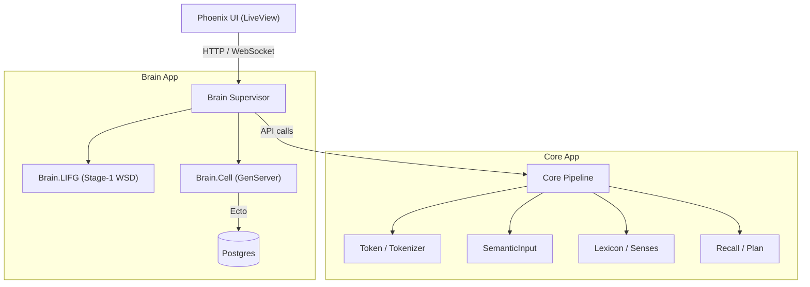

# Symbrella — Project Résumé / Playbook

**Owner:** Bradley  
**Stack:** Elixir / OTP, Phoenix (LiveView), Ecto, PostgreSQL, StreamData, Benchee

---

## TL;DR

- Built a **biologically-inspired sense disambiguation** pipeline anchored by `Brain.LIFG` (Left Inferior Frontal Gyrus analog) for Stage‑1 word-sense disambiguation (WSD).
- Integrated **control signals** (boosts/inhibitions) that fan out to lightweight `Brain.Cell` processes via a central **`Brain` coordinator**.
- Added **property, integration, and doctests**. All green locally after fixes.  
- Benchmarked both **softmax** and **max‑norm** normalizations; documented trade‑offs and memory profiles.
- Introduced **telemetry hooks** (`[:brain, :pipeline, :lifg_stage1, :stop]`) for visibility and tuning.


## Architecture Diagram

> Paste this in your README as-is to render on GitHub.




## Key Modules

### `Brain` (Coordinator)
- Keeps **STM** view: `active_cells`, `attention`, `history`.
- **DynamicSupervisor** for `Brain.Cell` processes; lazy start on demand.
- Public API:
  - `stm/1` – merges STM snapshot into SI.
  - `activate_cells/2` – batch activation for rows/ids/SI.
  - `lifg_stage1/3` – runs `Brain.LIFG.disambiguate_stage1/3`, then applies boosts/inhibitions as a **side‑effect**.
  - `cell_status/1`, `cell_cast/2`, `snapshot/0`, `via/1`.

### `Brain.LIFG` (Stage‑1 WSD)
- Scores candidate senses per token using weighted features:
  - `sim` (context similarity), `lex` (lexical fit), `rel` (relative prior), `prag` (intent bias), `act` (prior activation).
- **Normalization**: `:softmax` or `:maxnorm` (configurable).
- **Outputs**:
  - `choices` (winner, alternatives, margins, feature audit)
  - `boosts` (winner deltas) and `inhibitions` (loser deltas)
  - `audit` (weights, parallelism, ctx dim, groups, timing)
- Supports **parallel** and **serial** paths with deterministic reductions.

### `Brain.Cell`
- Minimal **GenServer** that tracks `activation` and reports to `Brain` via `{:activation_report, id, a}`.
- Accepts `{:activate, %{delta: number}}` casts.

### `Db.BrainCell` (Schema)
- Single consolidated table for senses; JSON‑encodable for transport.
- Clean `changeset/2` with PK `:id` — no separate uniqueness checks required.

---

## Telemetry

- Emit on Stage‑1 completion:
  - **Event**: `[:brain, :pipeline, :lifg_stage1, :stop]`
  - **Measurements**: `%{duration_ms: ms}`
  - **Metadata**: `%{groups, ctx_dim, normalize, scores_mode, parallel}`
- Helper:
  - `Brain.Telemetry.attach!/0` to install a simple logger (`brain-lifg-stage1-logger`).

---

## Tests

- **Unit & doctests**: scoring, normalization, margin behavior, vector lookup, etc.
- **Property tests** (StreamData): softmax group sums ≈ 1; bounded scores [0,1]; stability across randomized inputs.
- **Integration test**: decay + control deltas move winners into Top‑K over time.

> Current status locally: **all Brain tests passing** (doctests, properties, integration).

---

## Benchmarks (recent device run)

> Representative results (μs/op). Throughput and memory vary with groups × senses × vector dim.

- **g8_s3_d64** (8 tokens × 3 senses × 64‑dim)
  - Serial `maxnorm`: ~97 μs (≈ 10.3 K ops/s), ~110 KB
  - Serial `softmax`: ~100 μs (≈ 10.0 K ops/s), ~111 KB
- **g8_s6_d64**:
  - Serial `maxnorm`: ~202 μs (≈ 4.9 K ops/s), ~219 KB
- **g16_s4_d64**:
  - Serial `maxnorm`: ~269 μs (≈ 3.7 K ops/s), ~296 KB

Notes:
- Serial path is currently **faster** on a 6‑core mobile CPU; parallel reduces memory but adds overhead at small sizes.
- `:maxnorm` vs `:softmax` is nearly a wash in latency; **maxnorm** often wins by a hair and uses slightly less memory.

---

## Summary Repo Tree

```
apps/
  brain/         # cell processes, LIFG, telemetry, benches & tests
  core/          # tokenizer, semantic input, recall plan/execute, adapters
  db/            # Ecto schemas, Repo types, migrations
  lexicon/       # lexicon behaviour + adapter
  symbrella/     # OTP shell app
  symbrella_web/ # Phoenix LiveView UI
assets/          # static CSS
config/          # env runtime configs
```

---

## Example Flow

1. `Core.resolve_input/1` → tokenize → SI → `Brain.stm/1` → LTM fetch → Lexicon senses.
2. Convert senses to LIFG candidates → `Brain.lifg_stage1/3`.
3. LIFG returns `choices` and control deltas → `Brain` fans out `{:activate, %{delta: …}}` to cells.
4. Cells report `{:activation_report, id, a}` → Brain STM updates → downstream stages consume.

---

## How to Run Locally (dev)

```bash
mix deps.get
mix ecto.create && mix ecto.migrate
iex -S mix
```

Telemetry (optional):
```elixir
Brain.Telemetry.attach!()
:telemetry.list_handlers([:brain, :pipeline, :lifg_stage1, :stop])
```

Manual smoke in `iex`:
```elixir
ctx = [1.0, 0.0, 0.0]

cands =
  for {w, t} <- [{"hello", 0}, {"there", 1}], s <- 0..1 do
    %{id: "#{w}|noun|#{s}", pos: "noun", token_index: t, lemma: w,
      embedding: [1.0, 0.0, 0.0], lex_fit: 0.6, rel_prior: 0.5, intent_bias: 0.5, activation: 0.1}
  end

{:ok, out} = Brain.lifg_stage1(cands, ctx, normalize: :softmax, scores: :top2)
Brain.snapshot().active_cells
```

---

## Next Up

- Stage‑2 syntax/role propagation and short‑range inhibition windows.
- Intent‑aware weights via online learner (update `weights.prag`).
- CI benches on multiple sizes; wall‑time vs memory curves per normalization.
