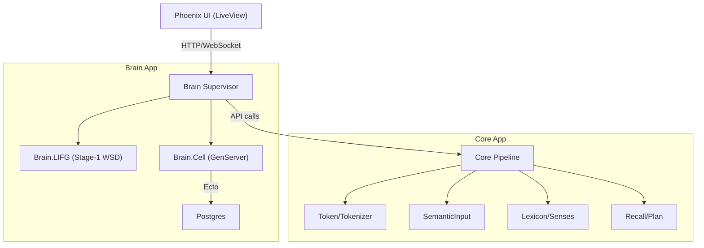

# Symbrella — Project Resume & Playbook

> High‑level overview, architecture, and developer workflow for the Symbrella monorepo.

---

## TL;DR

Symbrella is an Elixir umbrella that models a lightweight, neuro‑inspired **semantic pipeline**.  
Key parts:

- **Core**: tokenization, semantic input (SI), lexicon recall.
- **Brain**: central coordinator of per‑word **Cell** processes and **LIFG** (Stage‑1 lexical disambiguation).
- **DB**: Ecto schema for `Db.BrainCell` and Postgres migrations.
- **symbrella_web**: Phoenix UI (LiveView) and HTTP/WebSocket surface.

**What’s working now**

- `Brain.LIFG.disambiguate_stage1/3` (softmax or maxnorm normalization; serial/parallel; audit & telemetry).
- `Brain.lifg_stage1/3` Brain‑level orchestration that **applies control signals** (boosts/inhibitions) to Cell processes.
- Robust unit + property + integration tests passing; benches included.

---

## Architecture


```mermaid
flowchart TD
  UI["Phoenix UI (LiveView)"] -->|"HTTP/WebSocket"| Brain["Brain Supervisor"]

  subgraph "Brain App"
    Brain --> LIFG["Brain.LIFG (Stage-1 WSD)"]
    Brain --> Cell["Brain.Cell (GenServer)"]
    Cell -->|"Ecto"| DB["Postgres"]
  end

  Brain -->|"API calls"| Core["Core Pipeline"]

  subgraph "Core App"
    Core --> Tok["Token/Tokenizer"]
    Core --> Sem["SemanticInput"]
    Core --> Lex["Lexicon/Senses"]
    Core --> Recall["Recall/Plan"]
  end
```

---

## Pipeline Walkthrough (Human Sentence -> Active Sense Choices)

1. **Tokenize** the input into words and multi‑word candidates (`Core.Token.tokenize/1`).
2. **Populate SI** and fetch candidates from LTM (`Db.ltm/1` + `Core.Lexicon.all/1`), yielding `:db_cells`.
3. **Activate Cells (optional)**: `Brain.activate_cells/2` lazily starts cells and bumps their activation deltas.
4. **Stage‑1 Disambiguation (LIFG)**: `Brain.lifg_stage1/3` (or direct `Brain.LIFG.disambiguate_stage1/3`) computes winner(s) per token, producing:
   - `choices`: per‑token chosen sense + alternates, with features and normalized scores.
   - `boosts` and `inhibitions`: control‑signal deltas (e.g., `+0.5` winners, `-0.25` non‑winners).
   - `audit`: options, weights, timing, group counts, context dimension.
5. **Apply Control Signals**: Brain coalesces deltas and casts `{:activate, %{delta: d}}` to live cells.
6. **STM Merge**: `Brain.stm/1` can surface `active_cells` back into SI for downstream stages.

---

## Key Modules

### `Brain` (Coordinator)

- **Public API**:
  - `start_link/1` — supervisor child.
  - `stm/1` — returns SI with `:active_cells` snapshot.
  - `activate_cells/2` — accepts `[Db.BrainCell.t() | id]` or an SI with `:db_cells`.
  - `cell_status/1`, `cell_cast/2`, `snapshot/0`.
  - `lifg_stage1/3` — runs LIFG Stage‑1 and **applies boosts/inhibitions** as a side effect.
- **Internals**:
  - Registry: `Brain.Registry`; Cells supervised by `Brain.CellSup`.
  - Telemetry (stop event): `[:brain, :pipeline, :lifg_stage1, :stop]` with `%{duration_ms: ms}` and audit metadata.

**Example: Brain‑level LIFG with side effects**
```elixir
ctx = [1.0, 0.0, 0.0]
cands = [
  %{id: "hello|noun|0", token_index: 0, pos: "noun", lemma: "hello",
    embedding: [1.0,0.0,0.0], lex_fit: 0.6, rel_prior: 0.5, intent_bias: 0.5, activation: 0.1},
  %{id: "hello|noun|1", token_index: 0, pos: "noun", lemma: "hello",
    embedding: [1.0,0.0,0.0], lex_fit: 0.6, rel_prior: 0.5, intent_bias: 0.5, activation: 0.1}
]
{:ok, out} = Brain.lifg_stage1(cands, ctx, normalize: :softmax, scores: :top2)
# Cells for winners will receive positive deltas; others negative.
```

### `Brain.LIFG` (Stage‑1 WSD)

- **Function**: `disambiguate_stage1(candidates, context_vec, opts)`
- **Opts**:
  - `:normalize` — `:softmax` (probabilities) or `:maxnorm` (unit‑max scaling).
  - `:scores` — `:top1` or `:top2` (include runner‑up when the margin is small).
  - `:parallel` — `true | false | :auto`.
  - `:weights` — `%{lex: 0.25, sim: 0.4, rel: 0.15, prag: 0.1, act: 0.1}` (defaults).
  - `:margin_threshold` — include alternates when winner‑margin < threshold.
- **Returns**:
  - `{:ok, %{choices: [...], boosts: [...], inhibitions: [...], audit: %{...}}}`

**Quick check**
```elixir
{:ok, out} = Brain.LIFG.disambiguate_stage1(cands, ctx, normalize: :softmax)
Enum.map(out.choices, & &1.chosen_id)
```

### `Brain.Cell` (Per‑sense GenServer)

- Registers under `Brain.Registry` by id (e.g., `"hello|noun|0"`).
- Accepts `{:activate, %{delta: number}}` casts; reports back to `Brain` via `{:activation_report, id, a}`.
- Lightweight, suitable for thousands of cells; lazily started by `Brain`.

### `Db.BrainCell` (Ecto Schema)

- Primary key: `id` (string); selected fields are `@derived` for `Jason.Encoder`.
- Semantic attributes: `:word, :norm, :pos, :definition, :synonyms, :antonyms, :semantic_atoms, :activation, :dopamine, :serotonin, :connections, :position, :token_id, ...`.

### `Core` (Pipeline)

- Typical flow:
  ```elixir
  phrase
  |> Core.Token.tokenize()
  |> Brain.stm()
  |> Db.ltm()
  |> Core.Lexicon.all()
  |> Core.activate_cells()
  ```
- Integrates with Brain for STM merge and activation fan‑out; optional call into `Brain.lifg_stage1/3` when you want immediate control‑signal application.

---

## Benchmarks (Phone CPU, Elixir 1.18.4 / OTP 28)

Stage‑1, representative inputs:

| Config (groups/senses/dim) | Serial maxnorm (ips) | Serial softmax (ips) | Parallel* (ips) |
|---|---:|---:|---:|
| g8_s3_d64  | ~10.3K | ~10.0K | ~3.6–3.7K |
| g8_s6_d64  | ~4.9K  | ~4.8K  | ~2.4K |
| g16_s4_d64 | ~3.7K  | ~3.6K  | ~1.6–1.7K |
| g8_s3_d128 | ~5.5K  | ~5.4K  | ~2.5K |

\* Parallel showed overhead on the test device; keep `parallel: :auto`.

Memory footprints between softmax and maxnorm are roughly equal for same inputs.

---

## Testing & Quality

- **Unit + Doctest** for `Brain.LIFG`.
- **Property Tests** (StreamData): softmax sums per‑group ≈ 1; scores in [0,1].
- **Integration Test** simulates decay + control deltas to verify winners stabilize in Top‑K.
- **Benchmarks** with `Benchee`.

**Run**
```bash
mix test
mix test test/brain/brain_lifg_integration_test.exs
mix run test/brain/bench/bench_brain_lifg_bench.exs
```

---

## Telemetry

Attach the logger:
```elixir
Brain.Telemetry.attach!()
:telemetry.list_handlers([:brain, :pipeline, :lifg_stage1, :stop])
```

Sample log (info):
```
[LIFG] 6ms groups=2 ctx_dim=3 norm=:softmax scores=:top2 parallel=false
```

---

## Repo Layout (Summary)

```
apps/
  brain/         # Brain, LIFG, Cell, Telemetry + tests/benches
  core/          # Pipeline, lexicon, tokens, recall, vectors
  db/            # Ecto schema + migrations
  lexicon/       # Lexicon behaviour + adapters
  symbrella/     # OTP app entrypoint
  symbrella_web/ # Phoenix UI (LiveView)
config/          # Mix env configs
assets/          # CSS, frontend assets
```

---

## Getting Started

**Prereqs**: Elixir 1.18.x, Erlang/OTP 28, Postgres.

```bash
mix deps.get
mix ecto.setup   # creates DB and runs migrations
iex -S mix       # or: iex -S mix phx.server (for web)
```

**Quick sanity check in IEx**
```elixir
Logger.configure(level: :info)
Brain.Telemetry.attach!()

ctx = [1.0, 0.0, 0.0]
cands = for s <- 0..1 do
  %{id: "hello|noun|#{s}", token_index: 0, pos: "noun", lemma: "hello",
    embedding: [1.0,0.0,0.0], lex_fit: 0.6, rel_prior: 0.5, intent_bias: 0.5, activation: 0.1}
end
{:ok, out} = Brain.lifg_stage1(cands, ctx, normalize: :softmax, scores: :top2)
Brain.snapshot().active_cells # winners boosted, others inhibited
```

---

## Roadmap (Near‑Term)

- Stage‑2 concept composition (contextual constraints, co‑occurrence, graph walk).
- Intent conditioning and top‑K attention feedback to STM.
- Persisted activation traces and TTL decay policies.
- Performance polish on parallel path and vector lookup cache.

---

## Contributing

- Default branch: `master`.  
- Use concise commit subjects (<= 72 chars), e.g.:  
  `brain/lifg: add Brain.lifg_stage1 with control-signal fanout`

---

## License

TBD (add your license of choice here).
