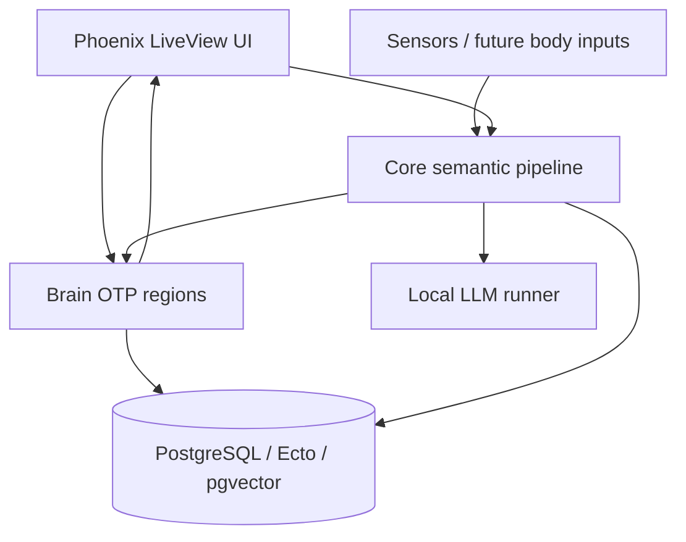

# Symbrella - Project Resume / Playbook

**Owner:** Bradley  
**Stack:** Elixir / OTP, Phoenix LiveView, Ecto, PostgreSQL, pgvector-ready
schemas, StreamData, Benchee, Nx, Axon, local llama.cpp integration

---

## TL;DR

Symbrella is a Phoenix umbrella application for an inspectable
biologically-inspired cognitive architecture. It is not a literal brain
simulation, not a clinical neurological model, and not evidence of
consciousness, sentience, feelings, or subjective experience. Region names are
engineering abstractions and functional correlates for bounded software
responsibilities.

The current project is no longer just a Stage1 WSD experiment. It now includes a
Core semantic pipeline, Brain OTP regions, LIFG Stage1 and Stage2, semantic
integration regions, hippocampal recall/persistence, curiosity and control
loops, mood/appraisal, a bounded SelfModel, self-continuity, meta-monitoring,
goal pressure, response planning, agency scaffolding, telemetry, calibration via
Nx/Axon, and LiveView debug surfaces.

The active frontier is:

```text
Phase 9:
Cognitive gating consolidation and behavior coupling
```

---

## Umbrella Architecture

Dependency direction stays:

```text
db <- brain <- core <- web
```

Core may call Brain and Db. Brain may call Db. Brain must not depend on Core or
the web app.


```mermaid
flowchart TD
  UI["Phoenix LiveView UI"]
  Core["Core semantic pipeline"]
  Brain["Brain OTP regions"]
  Db[("PostgreSQL / Ecto / pgvector")]
  Llm["Local LLM runner"]
  Sensors["Sensors / future body inputs"]

  Sensors --> Core
  UI --> Core
  UI --> Brain
  Core --> Brain
  Brain --> Db
  Core --> Db
  Core --> Llm
  Brain --> UI
```

Apps:

- `apps/brain`: region processes, LIFG, WorkingMemory, BasalGanglia, Thalamus,
  DLPFC/PFC, Hippocampus, MoodCore, SelfModel, Introspection, SelfContinuity,
  MetaMonitor, GoalStack, self-calibration, telemetry, and tests.
- `apps/core`: tokenization, `Core.SemanticInput`, MWE handling, evidence
  attachment, intent, recall planning, Brain adapters, response planning, and
  agency/ledger orchestration.
- `apps/db`: Ecto repo, schemas, migrations, episodes, brain cells,
  agency events, self snapshots, and persistence helpers.
- `apps/lexicon`: external dictionary and lexical adapter surface.
- `apps/llm`: local llama.cpp / `llama-server` boot and HTTP integration.
- `apps/symbrella`: umbrella runtime supervisor and shared infrastructure.
- `apps/symbrella_web`: Phoenix endpoint, LiveViews, components, assets, and
  debug/inspection surfaces.

---

## Brain Coordinator

`Brain` is the central runtime facade and coordinator for region interaction.
It keeps short-term/working-memory snapshots, activation history, region
coordination, and public helper APIs such as:

- `stm/1` for folding Brain context into semantic input;
- `activate_cells/2` for activation updates;
- `lifg_stage1/3` for Stage1 disambiguation;
- `focus/2` and related paths for WM focus/update behavior;
- `snapshot/0` and region status helpers for introspection;
- cached latest self-state support used by current Phase 9 WM policy coupling.

`Brain.Cell` processes still provide lightweight activation state and reports,
but the architecture has expanded beyond cell activation into explicit control,
memory, self-state, and agency subsystems.

---

## Current Core Semantic Pipeline

The production path starts in `Core.resolve_input/2` and intentionally remains
inspectable:

```text
phrase
-> tokenize word-level input
-> rebuild word n-grams
-> intent selection
-> STM / activation context
-> early MWE injection
-> LTM evidence
-> late MWE injection
-> relation edges
-> episode evidence
-> perception
-> amygdala/appraisal hooks
-> LIFG attach
-> event frames
-> prefrontal/action-selection attach
-> WM focus prompt topics
-> response plan
-> hippocampal encode/persist
-> activation telemetry
```

Core orchestrates this flow. Brain owns the region machinery and stateful
dynamics.

---

## Target Cognitive-Control Architecture

For planning, the canonical path is:

```text
Semantic / lexical representations
-> LIFG Stage1
   competitive semantic interpretation
-> LIFG Stage2
   linguistic evidence finalization
-> ACC / cognitive-control context
   conflict / uncertainty / task pressure
-> BasalGanglia
   canonical Working Memory admission gate
   :allow | :boost | :block
-> Thalamic relay / gating control
-> DLPFC / PFC control
-> WorkingMemory
   maintain / normalize / merge / decay / evict
```

The architecture is recurrent, not a one-way biological assembly line:

```text
WorkingMemory / PFC
-> LIFG context
-> BasalGanglia context
-> memory retrieval
-> attention/control
-> SelfModel evidence
```

Current code still has overlapping gate-like behavior in `Brain.LIFG.Stage2`,
`Brain.WM.Policy`, and `Brain.BasalGanglia`. Phase 9A should consolidate
general WM admission under the BasalGanglia/control layer while leaving
WorkingMemory focused on active-representation mechanics.

---

## Region Notes

### LIFG Stage1

`Brain.LIFG.Stage1` performs competitive semantic / word-sense selection.

Conceptual question:

```text
What interpretation is currently best supported?
```

It compares candidate senses and emits winner identity, confidence-like score,
margins, finalists, feature audit information, and control evidence. It should
not be documented or treated as the final WorkingMemory gate.

### LIFG Stage2

`Brain.LIFG.Stage2` exists and currently produces commit-shaped decisions.
Architecturally, it should finalize LIFG linguistic evidence: winner, score,
margin, ambiguity/conflict evidence, and provenance for downstream cognitive
gating.

Conceptual question:

```text
How strong and unambiguous was the linguistic decision?
```

Do not treat Stage2 as the canonical final WM admission authority. Its
commit-oriented behavior is an implementation area to consolidate.

### ATL / pMTG

`Brain.ATL` acts as a semantic hub analogue for broad concept integration.
`Brain.PMTG` is a controlled semantic retrieval analogue that can detect weak
choices, retrieval pressure, and rerun needs. Both should remain bounded and
traceable.

### ACC

`Brain.ACC` supplies bounded conflict, uncertainty, ambiguity, and task-pressure
context. It informs cognitive control but does not mutate WorkingMemory on its
own.

### OFC / VmPFC

`Brain.OFC` and `Brain.VmPFC` provide value-estimation and appraisal-like
signals. Their outputs can influence salience, risk, novelty, and control
context, but remain bounded engineering signals.

### BasalGanglia

`Brain.BasalGanglia` is the canonical target for general WorkingMemory admission.
It should own/generalize decisions such as:

```elixir
:allow | :boost | :block
```

Inputs may include evidence strength, attention/salience, WM fullness,
duplicates, cooldown, source preferences, goals/control context, conflict, and
bounded SelfModel modulation. If current config names such as `lifg_min_score`
appear, treat them as implementation-specific and future candidates for a more
general name like `evidence_floor` or `min_input_score`.

### Thalamus

`Brain.Thalamus` is a relay, arbitration, and gating-control analogue. It blends
signals such as curiosity, ACC conflict, OFC/VmPFC value, mood, and salience. It
is not the semantic decision-maker and should not become the owner of final WM
admission.

### DLPFC / PFC

`Brain.DLPFC` and `Brain.PFC` are executive/task-control and maintenance
analogues. They can apply control decisions and coordinate focus, but should not
become uncontrolled direct writers to WorkingMemory.

### WorkingMemory

`Brain.WorkingMemory` is the maintained active-representation store. Its
mechanical responsibilities are normalize, maintain, merge, activate, decay,
trim, evict, enforce bounded capacity, and emit telemetry.

The general decision "Should this candidate enter WM?" belongs upstream in the
cognitive gating/control layer. `Brain.WM.Policy` currently contains both
admission and retention mechanics; Phase 9A should separate those responsibilities
from BasalGanglia admission.

### Hippocampus

`Brain.Hippocampus` handles episodic encoding, recall, and persistence-backed
memory interaction. Recall should stay bounded by top-k/window/scoring limits
and should eventually route WM-ingress effects through the same canonical gate.

### Curiosity

`Brain.Curiosity` proposes probes and uncertainty-reduction moves. The current
curiosity path uses Thalamus, DLPFC/PFC, BasalGanglia/WM policy, and
WorkingMemory with telemetry. The target is:

```text
Curiosity
-> Thalamus relay/arbitration
-> BasalGanglia canonical admission
-> DLPFC/PFC control
-> WorkingMemory mechanics
```

### MoodCore

`Brain.MoodCore` applies bounded mood/chemistry-like control variables from
appraisal evidence. Neuromodulator names are analogies for control dimensions,
not claims of emotions.

### SelfModel

`Brain.SelfModel` is an engineering-level integration of runtime evidence:
confidence, uncertainty, stability, focus, vigilance, plasticity, inhibition,
cognitive load, mood, goals, recent errors/actions, appraisal, LIFG summary,
attribution, continuity, and version metadata.

SelfModel can modulate cognitive control but is not itself the gate:

```text
SelfModel
-> bounded modulation
-> BasalGanglia / cognitive gating
-> Working Memory update / hold
```

Current Phase 9 work has begun coupling vigilance, uncertainty, inhibition, and
cognitive load into WM admission scoring.

### Introspection

`Brain.Introspection` derives self-model updates from live Brain evidence,
publishes telemetry, and can publish the latest `%Brain.SelfModel{}` into the
Brain coordinator for downstream consumers.

`Brain.Introspect` and region `snapshot/0` / `status/0` calls support local and
LiveView inspection.

### SelfContinuity

`Brain.SelfContinuity` provides bounded warm-start and persistence-safe
restoration. It should only restore evidence-backed, version-checked, bounded
self-state. Stale, missing, invalid, or unsupported snapshots degrade
explicitly.

### MetaMonitor

`Brain.MetaMonitor` detects instability, contradiction, overload, stuck loops,
and uncertainty spikes, then emits warning/recovery suggestions such as
reanalyze, recall, lower confidence, change response mode, or ask for
clarification.

### GoalStack

`Brain.GoalStack` tracks active goals and tension/priority pressure. Current
work is strongest around uncertainty reduction and continuity of unresolved
tasks.

### Self-Calibration / Nx / Axon

The calibration stack is advisory:

```text
runtime evidence
-> rule-derived SelfModel
-> calibration sample
-> JSONL / dataset rows
-> Nx tensors
-> baseline predictor
-> Axon predictor
-> comparison
-> explicit blend decision
-> telemetry
```

It predicts bounded confidence, uncertainty, and stability. It must not silently
overwrite `Brain.SelfModel`, define identity, or bypass rule gates.

---

## Response Planning And Agency

`Core.Response.*` builds response plans and can route to local LLM-backed
phrasing through `Llm` when configured. Response planning already uses bounded
self-state for modes such as assert, hedge, explain, or repair.

The agency scaffold includes:

- `Brain.ActionSelector` and `Core.Brain.ActionSelection` for response posture;
- `Core.Response.AgencyLedger`, `Core.Response.AgencyMemory`, and
  `Core.Response.AgencyReflection` for event recording and reflection;
- agency events persisted through `Db`;
- a desired command boundary where action selection, permission/risk policy,
  execution, ledger recording, reflection, and learning remain separate.

Core rule:

```text
ActionSelector chooses.
Executor acts.
Ledger records.
Reflection evaluates.
Memory learns.
```

---

## Telemetry And Debug Surfaces

Important telemetry families include:

- `[:brain, :pipeline, :lifg_stage1, :stop]`
- `[:brain, :affect, :appraisal]`
- `[:brain, :mood, :appraisal_applied]`
- `[:brain, :self_model, :update]`
- `[:brain, :self_calibration, :sample_logged]`
- `[:brain, :self_calibration, :prediction]`
- `[:brain, :self_calibration, :blend]`
- `[:brain, :self_model, :continuity_restored]`
- `[:brain, :meta_monitor, :warning]`
- `[:brain, :response, :mode_selected]`
- WM/gate admission telemetry where implemented

LiveView/debug surfaces include chat/home, `/brain`, episode browsing,
telemetry-driven panels, mood HUDs, region overlays, self-model views, and
calibration/debug panels where present.

---

## Tests And Validation Targets

Useful focused test commands:

```bash
mix test apps/core/test/core/pipeline_contract_test.exs
mix test apps/core/test/core/resolve_input_test.exs
mix test apps/brain/test/brain/lifg_stage1_invariants_test.exs
mix test apps/brain/test/brain/lifg_stage2_contract_test.exs
mix test apps/brain/test/brain/curiosity_flow_test.exs
mix test apps/brain/test/brain/thalamus_*test.exs
mix test apps/brain/test/brain/wm_*test.exs
mix test apps/brain/test/brain/wm/wm_policy_test.exs
```

Current docs should not claim a warning-free compile. The umbrella compiles
successfully, but remaining compiler/type warnings exist in existing `db`,
`core`, and `symbrella_web` areas and should be tracked separately.

---

## How To Run Locally

From the umbrella root:

```bash
mix deps.get
mix db.setup
mix assets.build
mix phx.server
```

For an IEx session:

```bash
iex -S mix
```

Optional telemetry smoke:

```elixir
Brain.Telemetry.attach!()
:telemetry.list_handlers([:brain, :pipeline, :lifg_stage1, :stop])
```

Manual Stage1 smoke:

```elixir
ctx = [1.0, 0.0, 0.0]

cands =
  for {w, t} <- [{"hello", 0}, {"there", 1}], s <- 0..1 do
    %{
      id: "#{w}|noun|#{s}",
      pos: "noun",
      token_index: t,
      lemma: w,
      embedding: [1.0, 0.0, 0.0],
      lex_fit: 0.6,
      rel_prior: 0.5,
      intent_bias: 0.5,
      activation: 0.1
    }
  end

{:ok, out} = Brain.lifg_stage1(cands, ctx, normalize: :softmax, scores: :top2)
Brain.snapshot().active_cells
```

---

## Historical Stage1 Benchmark Notes

Older local benchmarks compared `:softmax` and `:maxnorm` Stage1 normalization.
At small candidate sizes, the serial path was often faster than parallel on the
tested device, and `:maxnorm` was usually slightly faster with slightly lower
memory. Re-run benches before relying on those numbers for current decisions.

---

## Next Up

Phase 9 is the active development priority:

```text
Cognitive gating consolidation and behavior coupling
```

Immediate targets:

1. Consolidate final WM admission under `Brain.BasalGanglia`.
2. Redefine `Brain.LIFG.Stage2` as linguistic evidence finalization rather than
   final WM admission.
3. Route LIFG Stage2 candidates through the canonical cognitive gate.
4. Reconcile `Brain.WM.Policy` admission responsibilities with
   `Brain.BasalGanglia`.
5. Ensure Hippocampus/recall and Curiosity/Thalamus/DLPFC ingress obey the same
   canonical gate.
6. Add tests proving no path bypasses the canonical gate and self-state
   modulation cannot bypass hard evidence/rule gates.
7. Preserve bounded scores and telemetry across all gate paths.
8. Continue behavior coupling for memory writes, tone/style, overload
   suppression, and calibration-rule gate tests.
