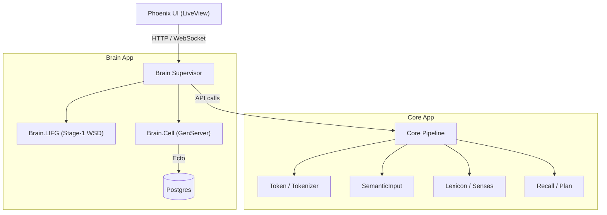
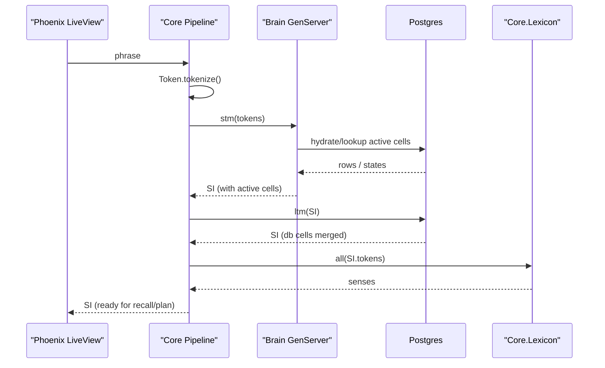

# Symbrella Phoenix **umbrella** app.

**Erlang/OTP:** 28 • **Elixir:** 1.18.x • **Phoenix:** 1.8.x (Bandit)  
Watchers are **disabled by design** — rebuild assets manually when you want.

---

## Quickstart

```bash
# from the umbrella root
mix deps.get

# (first time on a machine) install asset tool binaries
cd apps/symbrella_web
mix tailwind.install --if-missing
mix esbuild.install --if-missing
cd ../../

# build assets (manual by design)
mix tailwind default
mix esbuild default

# run the server
mix phx.server

# App: http://localhost:4000
# Re-run the two commands whenever you change CSS/JS:
#   mix tailwind default
#   mix esbuild default
```
## Architecture Diagram

> Paste this in your README as-is to render on GitHub.



---

## Project Layout (summary)

```
symbrella_umbrella/
.                                                                     ├── AGENTS.md
├── PROJECT-RESUME-PLAYBOOK.md
├── README-PATCH-v2.md
├── README-PATCH.md
├── README.md
├── README_BRAIN_CHAIN.md
├── README_guardrails_snippet.md
├── SYMBRELLA_PROJECT_GUARDRAILS.md
├── _config.yml
├── apps
│   ├── brain
│   │   ├── README.md
│   │   ├── bench
│   │   │   └── brain_lifg_bench_v2_1.exs
│   │   ├── brain_lifg_v2_1_2_pack.zip                                │   │   ├── lib
│   │   │   ├── brain
│   │   │   │   ├── acc.ex                                            │   │   │   │   ├── ag.ex
│   │   │   │   ├── amygdala.ex
│   │   │   │   ├── atl.ex
│   │   │   │   ├── bg.ex
│   │   │   │   ├── cell.ex
│   │   │   │   ├── cerebellum.ex
│   │   │   │   ├── chain.ex
│   │   │   │   ├── hippocampus.ex
│   │   │   │   ├── lifg                                              │   │   │   │   │   └── boundary_guard.ex
│   │   │   │   ├── lifg.ex
│   │   │   │   ├── lifg_guard.ex
│   │   │   │   ├── lifg_stage1.ex
│   │   │   │   ├── lifg_tripwire.ex
│   │   │   │   ├── mtl.ex
│   │   │   │   ├── neuromodulator.ex
│   │   │   │   ├── ofc.ex
│   │   │   │   ├── pmtg.ex
│   │   │   │   ├── priming.ex
│   │   │   │   ├── reanalysis.ex
│   │   │   │   ├── region.ex
│   │   │   │   ├── telemetry.ex
│   │   │   │   ├── thalamus.ex
│   │   │   │   └── working_memory.ex
│   │   │   └── brain.ex
│   │   ├── mix.exs
│   │   └── test
│   │       ├── brain
│   │       │   ├── bench
│   │       │   │   └── bench_brain_lifg_bench.exs
│   │       │   ├── boundary_guard_test.exs
│   │       │   ├── brain_lifg_integration_test.exs
│   │       │   ├── brain_lifg_property_test.exs
│   │       │   ├── brain_lifg_test.exs
│   │       │   ├── lifg_guard_test.exs
│   │       │   ├── lifg_priming_integration_test.exs
│   │       │   ├── lifg_tripwire_test.exs
│   │       │   ├── priming_test.exs
│   │       │   └── reanalysis_test.exs
│   │       └── test_helper.exs
│   ├── core
│   │   ├── README.md
│   │   ├── lib
│   │   │   ├── core
│   │   │   │   ├── brain
│   │   │   │   │   └── index.ex
│   │   │   │   ├── brain.ex
│   │   │   │   ├── brain_adapter.ex
│   │   │   │   ├── invariants.ex
│   │   │   │   ├── lex_id.ex
│   │   │   │   ├── lexicon
│   │   │   │   │   ├── normalize.ex
│   │   │   │   │   ├── senses.ex
│   │   │   │   │   └── stage.ex
│   │   │   │   ├── lexicon.ex
│   │   │   │   ├── lifg_input.ex
│   │   │   │   ├── mwe_injector.ex
│   │   │   │   ├── neg_cache.ex
│   │   │   │   ├── phrase_repo
│   │   │   │   │   └── default.ex
│   │   │   │   ├── phrase_repo.ex
│   │   │   │   ├── recall
│   │   │   │   │   ├── execute.ex
│   │   │   │   │   ├── gate.ex
│   │   │   │   │   └── plan.ex
│   │   │   │   ├── runtime_bind.ex
│   │   │   │   ├── segmenter.ex
│   │   │   │   ├── semantic_input.ex
│   │   │   │   ├── sense_slate.ex
│   │   │   │   ├── text.ex
│   │   │   │   ├── token.ex
│   │   │   │   ├── token_filters.ex
│   │   │   │   └── vectors.ex
│   │   │   ├── core.ex
│   │   │   └── math
│   │   │       └── math.ex
│   │   ├── mix.exs
│   │   ├── priv
│   │   │   └── negcache
│   │   │       └── negcache.dets
│   │   └── test
│   │       ├── core
│   │       │   ├── invariants_test.exs
│   │       │   ├── mwe_injector_test.exs
│   │       │   ├── resolve_input_test.exs
│   │       │   ├── runtime_bind_test.exs
│   │       │   ├── sense_slate_test.exs
│   │       │   ├── token_mw_test.exs
│   │       │   ├── tokenizer_defaults_test.exs
│   │       │   └── tokenizer_wordgrams_test.exs
│   │       └── test_helper.exs
│   ├── db
│   │   ├── README.md
│   │   ├── lib
│   │   │   ├── db
│   │   │   │   ├── brain_cell.ex
│   │   │   │   ├── episode.ex
│   │   │   │   ├── episodes.ex
│   │   │   │   ├── lexicon.ex
│   │   │   │   ├── my_embeddibgs.ex
│   │   │   │   └── postgrex_types.ex
│   │   │   └── db.ex
│   │   ├── mix.exs
│   │   ├── priv
│   │   │   ├── db
│   │   │   │   └── migrations
│   │   │   │       ├── 20250914053633_create_brain_cells_consolidated.exs
│   │   │   │       └── 20251001000000_create_episodes.exs
│   │   │   └── repo
│   │   │       └── migrations
│   │   │           └── 20250708150554_create_brain_cells.exs
│   │   └── test
│   │       ├── db
│   │       │   └── episodes_test.exs
│   │       ├── db_test.exs
│   │       └── test_helper.exs
│   ├── lexicon
│   │   ├── README.md
│   │   ├── lib
│   │   │   ├── lexicon
│   │   │   │   └── behaviou.ex
│   │   │   └── lexicon.ex
│   │   ├── mix.exs
│   │   └── test
│   │       ├── lexicon_test.exs
│   │       └── test_helper.exs
│   ├── symbrella
│   │   ├── README.md
│   │   ├── lib
│   │   │   ├── symbrella
│   │   │   │   ├── application.ex
│   │   │   │   └── mailer.ex
│   │   │   └── symbrella.ex
│   │   ├── mix.exs
│   │   └── test
│   │       └── test_helper.exs
│   └── symbrella_web
│       ├── README.md
│       ├── assets
│       │   ├── css
│       │   │   └── app.css
│       │   ├── js
│       │   │   ├── app.js
│       │   │   └── hooks
│       │   │       └── chat.js
│       │   ├── package.json
│       │   ├── postcss.config.js
│       │   ├── tailwind.config.js
│       │   ├── tsconfig.json
│       │   └── vendor
│       │       ├── daisyui-theme.js
│       │       ├── daisyui.js
│       │       ├── heroicons.js
│       │       └── topbar.js
│       ├── lib
│       │   ├── symbrella_web
│       │   │   ├── application.ex
│       │   │   ├── components
│       │   │   │   ├── core_components.ex
│       │   │   │   ├── layouts
│       │   │   │   │   └── root.html.heex
│       │   │   │   └── layouts.ex
│       │   │   ├── controllers
│       │   │   │   ├── error_html.ex
│       │   │   │   ├── error_json.ex
│       │   │   │   ├── page_controller.ex
│       │   │   │   ├── page_html
│       │   │   │   │   └── home.html.heex
│       │   │   │   └── page_html.ex
│       │   │   ├── endpoint.ex
│       │   │   ├── gettext.ex
│       │   │   ├── live
│       │   │   │   ├── brain_live.ex
│       │   │   │   └── home_live.ex
│       │   │   ├── router.ex
│       │   │   └── telemetry.ex
│       │   └── symbrella_web.ex
│       ├── mix.exs
│       ├── package.json
│       ├── priv
│       │   ├── gettext
│       │   │   ├── en
│       │   │   │   └── LC_MESSAGES
│       │   │   │       └── errors.po
│       │   │   └── errors.pot
│       │   └── static
│       │       ├── assets
│       │       │   ├── app.css
│       │       │   └── app.js
│       │       ├── favicon-91f37b602a111216f1eef3aa337ad763.ico
│       │       ├── favicon.ico
│       │       ├── images
│       │       │   ├── logo-06a11be1f2cdde2c851763d00bdd2e80.svg
│       │       │   ├── logo-06a11be1f2cdde2c851763d00bdd2e80.svg.gz
│       │       │   ├── logo.svg
│       │       │   └── logo.svg.gz
│       │       ├── robots-9e2c81b0855bbff2baa8371bc4a78186.txt
│       │       ├── robots-9e2c81b0855bbff2baa8371bc4a78186.txt.gz
│       │       ├── robots.txt
│       │       └── robots.txt.gz
│       └── test
│           ├── support
│           │   └── conn_case.ex
│           ├── symbrella_web
│           │   └── controllers
│           │       ├── error_html_test.exs
│           │       ├── error_json_test.exs
│           │       └── page_controller_test.exs
│           └── test_helper.exs
├── assets
│   └── css
│       └── app.css
├── benchmark_result.txt
├── config
│   ├── config.exs
│   ├── dev.exs
│   ├── prod.exs
│   ├── runtime.exs
│   └── test.exs
├── mix.exs
└── mix.lock
```

> ℹ️ If you see stray files at the repo root like `how origin` or
> `e --abbrev-ref --symbolic-full-name @{u}`, they likely came from an
> accidental shell redirection. Safe to delete.

---

## Minimal Assets

Ensure these exist in `apps/symbrella_web/assets`:

**js/app.js**
```js
// apps/symbrella_web/assets/js/app.js
import "phoenix_html"
```

**css/app.css**
```css
/* apps/symbrella_web/assets/css/app.css */
@tailwind base;
@tailwind components;
@tailwind utilities;
```

---

## Troubleshooting

- **Missing tailwind/esbuild**  
  Run (inside `apps/symbrella_web`):  
  `mix tailwind.install --if-missing && mix esbuild.install --if-missing`

- **Version warnings**  
  Align versions in `config/config.exs` (`:tailwind`, `:esbuild`) *or*
  reinstall with the version you prefer using the commands above.

- **No output files**  
  Rebuild:
  ```bash
  mix tailwind default && mix esbuild default
  ```
  Expected outputs:
  ```
  apps/symbrella_web/priv/static/assets/app.css
  apps/symbrella_web/priv/static/assets/app.js
  ```

---

## (Optional) One-Command Dev Script

Create `dev.sh` at the repo root:

```bash
#!/usr/bin/env bash
set -euo pipefail

mix deps.get
(
  cd apps/symbrella_web &&   mix tailwind.install --if-missing &&   mix esbuild.install --if-missing
)
mix tailwind default
mix esbuild default
mix phx.server
```

Then:
```bash
chmod +x dev.sh
./dev.sh
```

---

## License

TBD © 2025 Bradley (bushman77)
