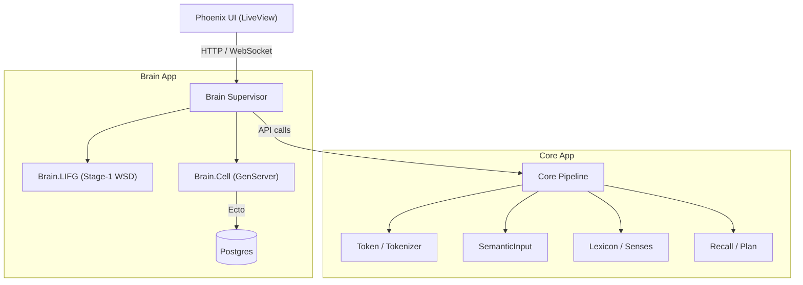
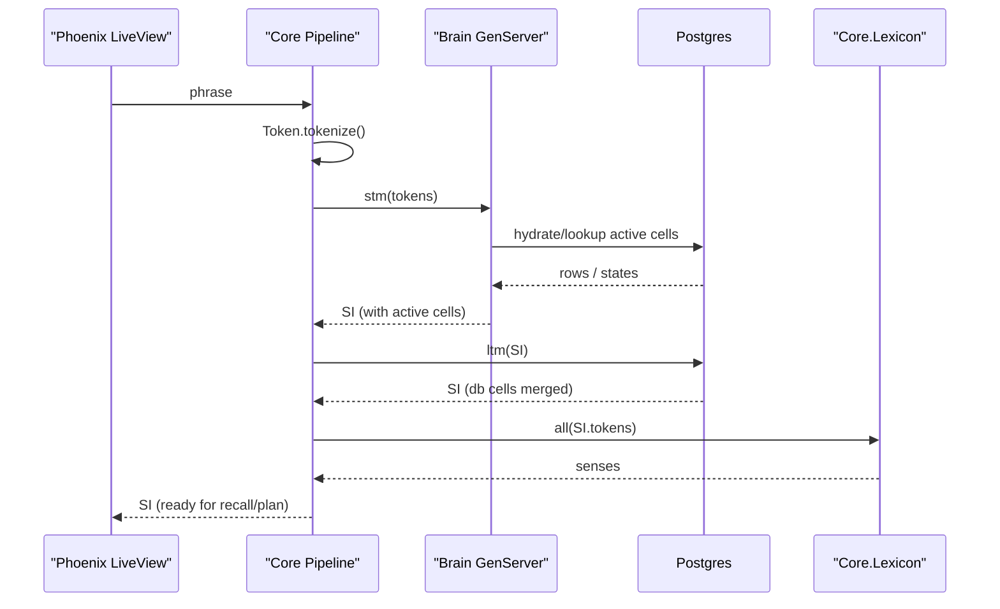

# Symbrella Phoenix **umbrella** app.

**Erlang/OTP:** 28 • **Elixir:** 1.18.x • **Phoenix:** 1.8.x (Bandit)  
Watchers are **disabled by design** — rebuild assets manually when you want.

---

## Quickstart

```bash
# from the umbrella root
mix deps.get

# (first time on a machine) install asset tool binaries
cd apps/symbrella_web
mix tailwind.install --if-missing
mix esbuild.install --if-missing
cd ../../

# build assets (manual by design)
mix tailwind default
mix esbuild default

# run the server
mix phx.server

# App: http://localhost:4000
# Re-run the two commands whenever you change CSS/JS:
#   mix tailwind default
#   mix esbuild default
```
## Architecture Diagram

> Paste this in your README as-is to render on GitHub.



---

## Project Layout (summary)

```
symbrella_umbrella/
├─ apps/
│  ├─ brain/                 # Brain runtime + LIFG (disambiguation)
│  │  ├─ lib/brain/
│  │  │  ├─ cell.ex
│  │  │  ├─ lifg.ex
│  │  │  ├─ lifg_stage1.ex
│  │  │  └─ telemetry.ex
│  │  ├─ bench/              # microbenchmarks
│  │  └─ test/brain/         # unit, property, integration & benches
│  ├─ core/                  # SI pipeline, recall, lexicon glue
│  │  ├─ lib/core/
│  │  │  ├─ brain/           # adapter & index
│  │  │  ├─ lexicon/         # normalize/senses/stage
│  │  │  ├─ recall/          # plan/gate/execute
│  │  │  ├─ semantic_input.ex
│  │  │  └─ …
│  ├─ db/                    # Ecto schemas & repo types
│  │  └─ lib/db/
│  │     ├─ brain_cell.ex
│  │     ├─ lexicon.ex
│  │     └─ postgrex_types.ex
│  ├─ lexicon/               # pluggable lexicon behaviour
│  ├─ symbrella/             # OTP app shell
│  └─ symbrella_web/         # Phoenix + Tailwind/Esbuild
│     ├─ assets/             # css/js; watchers are manual by design
│     └─ lib/symbrella_web/  # controllers, live, components, etc.
├─ config/                   # umbrella-wide config
├─ assets/                   # shared styling
├─ mix.exs
└─ mix.lock
```

> ℹ️ If you see stray files at the repo root like `how origin` or
> `e --abbrev-ref --symbolic-full-name @{u}`, they likely came from an
> accidental shell redirection. Safe to delete.

---

## Minimal Assets

Ensure these exist in `apps/symbrella_web/assets`:

**js/app.js**
```js
// apps/symbrella_web/assets/js/app.js
import "phoenix_html"
```

**css/app.css**
```css
/* apps/symbrella_web/assets/css/app.css */
@tailwind base;
@tailwind components;
@tailwind utilities;
```

---

## Troubleshooting

- **Missing tailwind/esbuild**  
  Run (inside `apps/symbrella_web`):  
  `mix tailwind.install --if-missing && mix esbuild.install --if-missing`

- **Version warnings**  
  Align versions in `config/config.exs` (`:tailwind`, `:esbuild`) *or*
  reinstall with the version you prefer using the commands above.

- **No output files**  
  Rebuild:
  ```bash
  mix tailwind default && mix esbuild default
  ```
  Expected outputs:
  ```
  apps/symbrella_web/priv/static/assets/app.css
  apps/symbrella_web/priv/static/assets/app.js
  ```

---

## (Optional) One-Command Dev Script

Create `dev.sh` at the repo root:

```bash
#!/usr/bin/env bash
set -euo pipefail

mix deps.get
(
  cd apps/symbrella_web &&   mix tailwind.install --if-missing &&   mix esbuild.install --if-missing
)
mix tailwind default
mix esbuild default
mix phx.server
```

Then:
```bash
chmod +x dev.sh
./dev.sh
```

---

## License

TBD © 2025 Bradley (bushman77)
