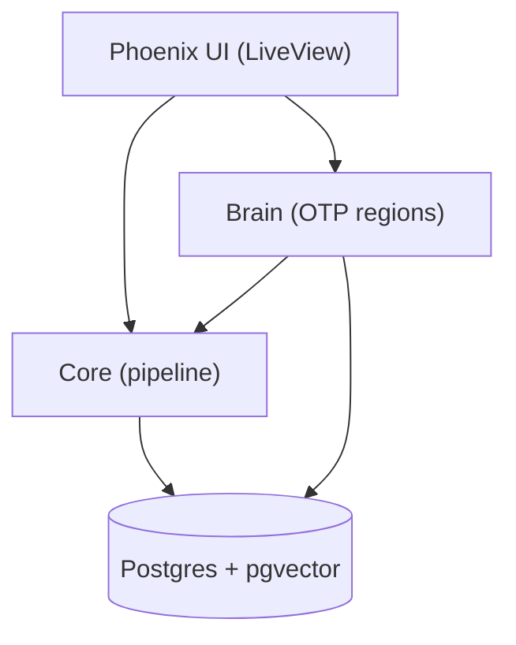

# Symbrella — Neuro-Symbolic Synthetic Intelligence (NSSI)

**Erlang/OTP:** 28 • **Elixir:** 1.18.x • **Phoenix:** 1.8.x (Bandit)

> Symbrella is an NSSI (Neuro‑Symbolic Synthetic Intelligence) umbrella app.  
> It models brain‑inspired regions (LIFG, PMTG, Hippocampus, ACC, Basal Ganglia, etc.) as OTP processes, combining symbolic structure with learned signals (Axon/Nx, embeddings, episodic recall).

---

## Quickstart

```bash
# from the umbrella root
mix deps.get

# (first time on a machine) install asset tool binaries
cd apps/symbrella_web
mix tailwind.install --if-missing
mix esbuild.install --if-missing
cd ../../

# build assets (manual on purpose)
mix tailwind default
mix esbuild default

# run the server
mix phx.server

# App: http://localhost:4000
# Re-run the two commands whenever you change CSS/JS:
#   mix tailwind default
#   mix esbuild default
```

---

## Apps at a glance

- **apps/brain** — Brain regions + working memory. **Owns LIFG** selection and episodic coordination (Hippocampus).
- **apps/core** — Orchestrates the pipeline (tokenize → Brain STM → Db LTM → Lexicon). SemanticInput, MWE injection, invariants.
- **apps/db** — Ecto schemas (BrainCell, Episode, Lexicon) + Repo; pgvector support for embeddings.
- **apps/lexicon** — Adapter layer for dictionary/lexicon sources.
- **apps/llm** — LLM client surface (work in progress).
- **apps/symbrella** — Umbrella runtime; single supervisor tree.
- **apps/symbrella_web** — Phoenix LiveView UI (brain view, chat hooks, etc.).

See **SYMBRELLA_PROJECT_GUARDRAILS.md** for module boundaries, approval protocol, and invariants.

---

## Architecture (high level)



**Golden pipeline**

```elixir
phrase
|> Core.Token.tokenize()   # word tokens first; sentence-aware spans
|> Brain.stm()             # short-term focus/activation (processes)
|> Db.ltm()                # long-term memory fetch (rows)
|> Core.Lexicon.all()      # dictionary lookups as needed
```

---

## LIFG DoD — working checklist (Oct 9, 2025)

- [ ] No char-grams in LIFG path (enforced + unit test)
- [ ] Boundary guard (drop non-word-boundary substrings unless `mw: true`)
- [ ] MWE injection pass (word-level n-grams before LIFG)
- [✅] Sense slate in SI (`si.sense_candidates` keyed by token index)
- [ ] Reanalysis fallback (flip to next-best on integration failure)
- [ ] Telemetry tripwire (log/drop if a char-gram reaches LIFG)
- [ ] Priming cache (optional; recency boost for recent winners)
- [ ] Invariant tests (spans sorted; no char-grams; boundary-only unless `mw: true`)
- [ ] Config defaults (test/dev: `tokenizer_mode: :words`, `tokenizer_emit_chargrams: false`)

Details and rationale live in **SYMBRELLA_PROJECT_GUARDRAILS.md**.

---

## Development tips

```bash
# run everything
mix test

# format + compile
mix format
mix compile

# run a single test file
mix test apps/brain/test/brain/lifg_guard_test.exs

# micro-benchmarks (examples)
mix run apps/brain/bench/brain_stage1_bench.exs
mix run apps/brain/bench/brain_lifg_bench_v2_1.exs
```

**Telemetry testing**  
`test/support/telemetry_helpers.exs` provides `capture/3` (assert emitted) and you can add `refute_emitted/3` similarly.

**Tokenizer defaults (dev/test):**

```elixir
config :core,
  tokenizer_mode: :words,
  tokenizer_emit_chargrams: false
```

---

## Repository layout (current)

```text
├── AGENTS.md
├── PROJECT-RESUME-PLAYBOOK.md
├── README.md
├── README_BRAIN_CHAIN.md
├── README_guardrails_snippet.md
├── SYMBRELLA_PROJECT_GUARDRAILS.md
├── _config.yml
├── apps
│   ├── brain
│   │   ├── README.md
│   │   ├── bench
│   │   │   ├── brain_lifg_bench_v2_1.exs
│   │   │   ├── brain_stage1_bench.exs
│   │   │   └── profile_stage1.exs
│   │   ├── brain_lifg_v2_1_2_pack.zip
│   │   ├── lib
│   │   │   ├── brain
│   │   │   │   ├── acc.ex
│   │   │   │   ├── atl.ex
│   │   │   │   ├── attention.ex
│   │   │   │   ├── basal_ganglia.ex
│   │   │   │   ├── cell.ex
│   │   │   │   ├── episodes
│   │   │   │   │   └── writer.ex
│   │   │   │   ├── hippocampus
│   │   │   │   │   ├── config.ex
│   │   │   │   │   ├── dup.ex
│   │   │   │   │   ├── evidence.ex
│   │   │   │   │   ├── normalize.ex
│   │   │   │   │   ├── recall.ex
│   │   │   │   │   ├── scoring.ex
│   │   │   │   │   ├── telemetry.ex
│   │   │   │   │   └── window.ex
│   │   │   │   ├── hippocampus.ex
│   │   │   │   ├── lifg
│   │   │   │   │   ├── boundary_guard.ex
│   │   │   │   │   ├── gate.ex
│   │   │   │   │   ├── guard.ex
│   │   │   │   │   ├── hygiene.ex
│   │   │   │   │   ├── input.ex
│   │   │   │   │   ├── reanalysis.ex
│   │   │   │   │   ├── stage1.ex
│   │   │   │   │   └── stage1_guard.ex
│   │   │   │   ├── lifg.ex
│   │   │   │   ├── ptmg.ex
│   │   │   │   ├── telemetry.ex
│   │   │   │   ├── utils
│   │   │   │   │   ├── control_signals.ex
│   │   │   │   │   ├── numbers.ex
│   │   │   │   │   ├── safe.ex
│   │   │   │   │   └── tokens.ex
│   │   │   │   └── working_memory.ex
│   │   │   └── brain.ex
│   │   ├── mix.exs
│   │   └── test
│   │       ├── brain
│   │       │   ├── basal_ganglia_edges_test.exs
│   │       │   ├── basal_ganglia_smoke_test.exs
│   │       │   ├── basal_ganglia_test.exs
│   │       │   ├── bench
│   │       │   │   └── bench_brain_lifg_bench.exs
│   │       │   ├── boundary_guard_test.exs
│   │       │   ├── brain_lifg_integration_test.exs
│   │       │   ├── brain_lifg_property_test.exs
│   │       │   ├── brain_lifg_test.exs
│   │       │   ├── hippocampus_attach_episodes_test.exs
│   │       │   ├── hippocampus_behavior_test.exs
│   │       │   ├── hippocampus_recall_test.exs
│   │       │   ├── hippocampus_stub.exs.disabled
│   │       │   ├── hippocampus_telemetry_test.exs
│   │       │   ├── lifg_alignment_test.exs
│   │       │   ├── lifg_gating_test.exs
│   │       │   ├── lifg_guard_test.exs
│   │       │   ├── lifg_mwe_fallback_test.exs
│   │       │   ├── lifg_priming_integration_test.exs
│   │       │   ├── lifg_scores_mode_test.exs
│   │       │   ├── lifg_tripwire_test.exs
│   │       │   ├── no_self_calls_test.exs
│   │       │   ├── pmtg_rerun_test.exs
│   │       │   ├── pmtg_sense_compat_test.exs
│   │       │   ├── priming_test.exs
│   │       │   ├── reanalysis_test.exs
│   │       │   ├── recall_gating_test.exs
│   │       │   ├── wm_dynamics_test.exs
│   │       │   ├── wm_eviction_decay_test.exs
│   │       │   ├── wm_gate_integration_test.exs
│   │       │   └── wm_gating_integration_test.exs
│   │       ├── support
│   │       │   └── telemetry_helpers.exs
│   │       └── test_helper.exs
│   ├── core
│   │   ├── README.md
│   │   ├── lib
│   │   │   ├── core
│   │   │   │   ├── brain
│   │   │   │   │   └── index.ex
│   │   │   │   ├── brain.ex
│   │   │   │   ├── brain_adapter.ex
│   │   │   │   ├── input.ex
│   │   │   │   ├── invariants.ex
│   │   │   │   ├── lex_id.ex
│   │   │   │   ├── lexicon
│   │   │   │   │   ├── normalize.ex
│   │   │   │   │   ├── senses.ex
│   │   │   │   │   └── stage.ex
│   │   │   │   ├── lexicon.ex
│   │   │   │   ├── lifg_input.ex
│   │   │   │   ├── mwe_injector.ex
│   │   │   │   ├── neg_cache.ex
│   │   │   │   ├── phrase_repo
│   │   │   │   │   └── default.ex
│   │   │   │   ├── phrase_repo.ex
│   │   │   │   ├── recall
│   │   │   │   │   ├── execute.ex
│   │   │   │   │   ├── gate.ex
│   │   │   │   │   └── plan.ex
│   │   │   │   ├── runtime_bind.ex
│   │   │   │   ├── segmenter.ex
│   │   │   │   ├── semantic_input.ex
│   │   │   │   ├── sense_slate.ex
│   │   │   │   ├── text.ex
│   │   │   │   ├── token.ex
│   │   │   │   ├── token_filters.ex
│   │   │   │   └── vectors.ex
│   │   │   ├── core.ex
│   │   │   └── math
│   │   │       └── math.ex
│   │   ├── mix.exs
│   │   ├── priv
│   │   │   └── negcache
│   │   │       └── negcache.dets
│   │   └── test
│   │       ├── core
│   │       │   ├── invariants_test.exs
│   │       │   ├── lifg_input_test.exs
│   │       │   ├── mwe_injector_test.exs
│   │       │   ├── recall
│   │       │   │   └── execute_hippo_integration_test.exs
│   │       │   ├── resolve_input_test.exs
│   │       │   ├── runtime_bind_test.exs
│   │       │   ├── semantic_input_sense_candidates_test.exs
│   │       │   ├── sense_slate_test.exs
│   │       │   ├── token_mw_test.exs
│   │       │   ├── token_test.exs
│   │       │   ├── tokenizer_defaults_test.exs
│   │       │   └── tokenizer_wordgrams_test.exs
│   │       └── test_helper.exs
│   ├── db
│   │   ├── README.md
│   │   ├── lib
│   │   │   ├── db
│   │   │   │   ├── brain_cell.ex
│   │   │   │   ├── episode.ex
│   │   │   │   ├── episodes.ex
│   │   │   │   ├── lexicon.ex
│   │   │   │   ├── my_embeddibgs.ex
│   │   │   │   └── postgrex_types.ex
│   │   │   └── db.ex
│   │   ├── mix.exs
│   │   ├── priv
│   │   │   ├── db
│   │   │   │   └── migrations
│   │   │   │   ├── 20250914053633_create_brain_cells_consolidated.exs
│   │   │   │   └── 20251001000000_create_episodes.exs
│   │   │   └── repo
│   │   │       └── migrations
│   │   │           └── 20250708150554_create_brain_cells.exs
│   │   └── test
│   │       ├── db
│   │       │   └── episodes_test.exs
│   │       ├── db_test.exs
│   │       └── test_helper.exs
│   ├── lexicon
│   │   ├── README.md
│   │   ├── lib
│   │   │   ├── lexicon
│   │   │   │   └── behaviou.ex
│   │   │   └── lexicon.ex
│   │   ├── mix.exs
│   │   └── test
│   │       └── test_helper.exs
│   ├── llm
│   │   ├── README.md
│   │   ├── lib
│   │   │   └── llm.ex
│   │   ├── mix.exs
│   │   └── test
│   │       ├── llm_test.exs
│   │       └── test_helper.exs
│   ├── symbrella
│   │   ├── README.md
│   │   ├── lib
│   │   │   ├── symbrella
│   │   │   │   ├── application.ex
│   │   │   │   └── mailer.ex
│   │   │   └── symbrella.ex
│   │   ├── mix.exs
│   │   └── test
│   │       └── test_helper.exs
│   └── symbrella_web
│       ├── README.md
│       ├── assets
│       │   ├── css
│       │   │   └── app.css
│       │   ├── js
│       │   │   ├── app.js
│       │   │   └── hooks
│       │   │       └── chat.js
│       │   ├── package.json
│       │   ├── postcss.config.js
│       │   ├── tailwind.config.js
│       │   ├── tsconfig.json
│       │   └── vendor
│       │       ├── daisyui-theme.js
│       │       ├── daisyui.js
│       │       ├── heroicons.js
│       │       └── topbar.js
│       ├── lib
│       │   ├── symbrella_web
│       │   │   ├── application.ex
│       │   │   ├── components
│       │   │   │   ├── core_components.ex
│       │   │   │   ├── layouts
│       │   │   │   │   └── root.html.heex
│       │   │   │   └── layouts.ex
│       │   │   ├── controllers
│       │   │   │   ├── error_html.ex
│       │   │   │   ├── error_json.ex
│       │   │   │   ├── page_controller.ex
│       │   │   │   ├── page_html
│       │   │   │   │   └── home.html.heex
│       │   │   │   └── page_html.ex
│       │   │   ├── endpoint.ex
│       │   │   ├── gettext.ex
│       │   │   ├── live
│       │   │   │   ├── brain_live.ex
│       │   │   │   └── home_live.ex
│       │   │   ├── router.ex
│       │   │   └── telemetry.ex
│       │   └── symbrella_web.ex
│       ├── mix.exs
│       ├── package.json
│       ├── priv
│       │   ├── gettext
│       │   │   ├── en
│       │   │   │   └── LC_MESSAGES
│       │   │   │       └── errors.po
│       │   │   └── errors.pot
│       │   └── static
│       │       ├── assets
│       │       │   ├── app.css
│       │       │   └── app.js
│       │       ├── favicon-91f37b602a111216f1eef3aa337ad763.ico
│       │       ├── favicon.ico
│       │       ├── images
│       │       │   ├── logo-06a11be1f2cdde2c851763d00bdd2e80.svg
│       │       │   ├── logo-06a11be1f2cdde2c851763d00bdd2e80.svg.gz
│       │       │   ├── logo.svg
│       │       │   └── logo.svg.gz
│       │       ├── robots-9e2c81b0855bbff2baa8371bc4a78186.txt
│       │       ├── robots-9e2c81b0855bbff2baa8371bc4a78186.txt.gz
│       │       ├── robots.txt
│       │       └── robots.txt.gz
│       └── test
│           ├── support
│           │   └── conn_case.ex
│           ├── symbrella_web
│           │   └── controllers
│           │       ├── error_html_test.exs
│           │       ├── error_json_test.exs
│           │       └── page_controller_test.exs
│           └── test_helper.exs
├── assets
│   └── css
│       └── app.css
├── brain_stage1_bench.md
├── config
│   ├── config.exs
│   ├── dev.exs
│   ├── prod.exs
│   ├── runtime.exs
│   └── test.exs
├── mix.exs
└── mix.lock
```

---

## Docs & references

- **Guardrails:** `SYMBRELLA_PROJECT_GUARDRAILS.md`
- **Brain chain notes:** `README_BRAIN_CHAIN.md`
- **Agents overview:** `AGENTS.md`
- **Resume playbook:** `PROJECT-RESUME-PLAYBOOK.md`

---

## Approval protocol

Nothing merges or “goes live” without an explicit approval token (see `SYMBRELLA_PROJECT_GUARDRAILS.md`).  
Example: `Approve: P-021 (FileScope: README.md)`.
