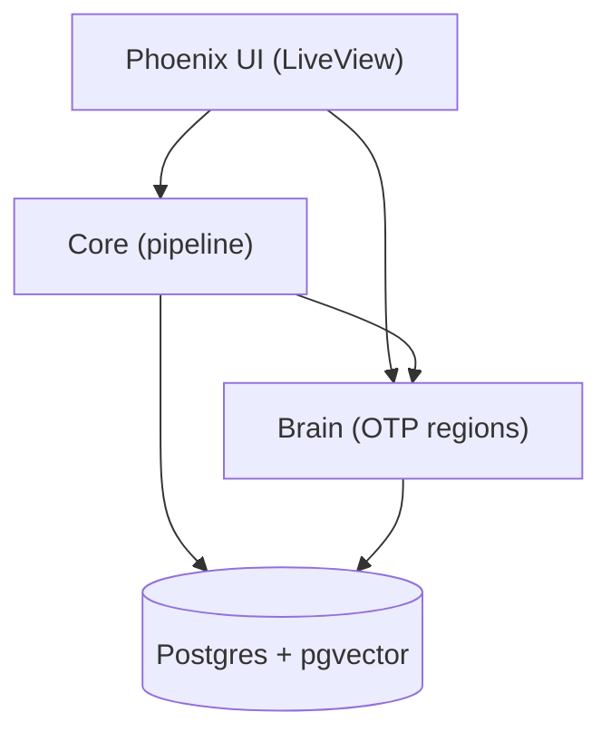

# Symbrella — Neuro-Symbolic Synthetic Intelligence (NSSI)

**Erlang/OTP:** 28 • **Elixir:** 1.18.x • **Phoenix:** 1.8.x (Bandit)

> Symbrella is an NSSI (Neuro‑Symbolic Synthetic Intelligence) umbrella app.  
> It models brain‑inspired regions (LIFG, PMTG, Hippocampus, ACC, Basal Ganglia, Thalamus, DLPFC, etc.) as OTP processes, combining symbolic structure with learned signals (Axon/Nx, embeddings, episodic recall).

Symbrella treats your phone (and eventually real robots) as a **body**, and this umbrella as a **brain**.  
It combines:

- **Neural models** (Axon/Nx, embeddings)  
- **Symbolic control** (GenServers, policies, Ecto-backed memory)  
- **Brain-inspired regions** (LIFG, PMTG, Hippocampus, WM, Mood, Curiosity, Thalamus, DLPFC, Cerebellum, etc.)

…into a single, inspectable cognitive system you can run locally.

---

## Why Symbrella?

Most AI systems today look like this:

> “Send text to a big model in the cloud → get a text answer back.”

Symbrella is for people who want more:

- A **long-lived brain** with state, mood, memories, and habits.  
- A **cognitive pipeline** you can actually see and debug.  
- A path from **phone** → **VR cockpit** → **physical robot** without changing the mental model.

Instead of treating AI as a black-box API, Symbrella treats it as a **living system** with regions, episodes, and working memory.

Modern AI stacks are converging on a similar pattern:

> **Neural core** + **symbolic wrapper** + **tools & memory**.

Reasoning models (e.g. “reasoning” LLMs and agent frameworks) follow this pattern, even if they don’t use brain metaphors or region names.

Symbrella lives in that same ecosystem, but pushes harder on the **“actual brain”** side:

- Named cortical/subcortical regions instead of anonymous “agents”  
- Explicit Working Memory and episodic recall stages  
- Mood / neuromodulators that can influence control flow  
- An explicit path to **embodiment** (phone sensors, VR, robots)

See **SYMBRELLA_PROJECT_GUARDRAILS.md** for module boundaries, approval protocol, and invariants.

---

## Quickstart

```bash
# from the umbrella root
mix deps.get

# (first time on a machine) install asset tool binaries
cd apps/symbrella_web
mix tailwind.install --if-missing
mix esbuild.install --if-missing
cd ../../

# build assets (manual on purpose)
mix tailwind default
mix esbuild default

# run the server
mix phx.server

# App: http://localhost:4000
# Re-run the two commands whenever you change CSS/JS:
#   mix tailwind default
#   mix esbuild default
```

---

## Apps at a glance

- **apps/brain** — OTP brain regions, working memory, LIFG Stage-1/Stage-2, episodic recall, curiosity/thalamus/DLPFC gating, mood, self-model, cycle clock, and telemetry.
- **apps/core** — Semantic orchestration: tokenization, `Core.SemanticInput`, MWE injection, sense slates, intent selection, recall planning, response policy, and LLM synthesis hooks.
- **apps/db** — Ecto repo `Db`, schemas, migrations, pgvector support, JSONL import helpers, episodes, brain cells, cerebellum models, and self snapshots.
- **apps/lexicon** — External dictionary/lexicon adapter surface used by Core enrichment.
- **apps/llm** — Local llama.cpp/`llama-server` runner and `Req` client for chat, model listing, and embeddings.
- **apps/symbrella** — Umbrella runtime supervisor: PubSub, Db, Brain regions, LLM runner, telemetry bridges, and shared infrastructure.
- **apps/symbrella_web** — Phoenix LiveView UI: home/chat surface, `/brain` dashboard, region overlays, HUD chips, and telemetry-driven panels.

---

## Symbrella in the AI landscape

At a high level, you can think of Symbrella next to a “typical” modern reasoning stack:

```text
┌────────────────────────────┐        ┌────────────────────────────┐
│ OpenAI-style Reasoning     │        │ Symbrella Brain Stack      │
└────────────────────────────┘        └────────────────────────────┘

User prompt                          Sensor / user input
      │                                         │
      ▼                                         ▼
Orchestrator / agent                Core.resolve_input/2
(choose tools, model, plan)         (Tokenize → MWE → LTM → evidence → LIFG)
      │                                         │
      ▼                                         ▼
Reasoning model (LLM)                Brain regions:
(internal chain-of-thought)          LIFG ⇄ ATL ⇄ Hippocampus ⇄ WM ⇄ Mood ⇄ Cerebellum
      │                                         │
      ▼                                         ▼
Tools (search, code, DB, …)          Curiosity, Thalamus, BasalGanglia, DLPFC, tools/sensors
      │                                         │
      ▼                                         ▼
Answer synthesis                     Phrase / action / UI output
      │                                         │
      ▼                                         ▼
   User                                 User / robot / VR scene
```

Both sides have:

- A **neural engine** that does the heavy “thinking”  
- A **symbolic / programmatic layer** that controls flow, tools, and memory  
- Some notion of **context and history** beyond a single request  

The difference is how explicit and “brain-like” those pieces are.

### Neural core

| Aspect                | OpenAI-style reasoning stack                                 | Symbrella                                             |
|----------------------|--------------------------------------------------------------|-------------------------------------------------------|
| Engine               | Large transformer reasoning model                            | Axon/Nx models, embeddings, small task-specific nets |
| How it’s used        | Called via API by an orchestrator / agent                    | Called from Brain/Core as one piece of the pipeline  |
| Visibility           | Internal chain-of-thought mostly hidden from users           | Activations and decisions can be exposed via WM, telemetry, UI |

Symbrella leans into **small, inspectable circuits** instead of a single giant opaque model.

### Symbolic / control layer

| Aspect          | OpenAI-style reasoning stack                     | Symbrella brain stack                                 |
|----------------|---------------------------------------------------|-------------------------------------------------------|
| Orchestration  | Agents, planners, tool routers                    | `Brain` as central coordinator + `use Brain, region:` macros |
| Control flow   | “If task X → call tool Y → call model Z”          | Region graph: LIFG → ATL → Hippocampus → WM/Mood/etc. |
| Representation | JSON, workflows, system prompts                   | GenServers, structs, Ecto schemas, SemanticInput state |

Symbrella’s “agents” are literally **named brain regions** with explicit responsibilities.

### Memory

| Type                 | OpenAI-style reasoning stack                        | Symbrella                                                 |
|----------------------|-----------------------------------------------------|-----------------------------------------------------------|
| Short-term context   | Chat history + hidden scratchpad tokens             | Working Memory (WM) focus set + SI trace + `active_cells` |
| Long-term knowledge  | Model weights, plus external RAG/vector stores      | BrainCell DB, Lexicon, and future pgvector recall         |
| Episodic memory      | Often app-specific logs or vector DB entries        | `Brain.Hippocampus` + `Db.Episode`, recency & outcome uplift |

Symbrella treats **episodic memory** as a first-class brain stage, not just a feature of a retrieval library.

### Attention, gating, and meta-control

| Aspect          | OpenAI-style reasoning stack                  | Symbrella                                           |
|----------------|-----------------------------------------------|-----------------------------------------------------|
| Attention      | Transformer attention + orchestrator hints    | WM admission policy + focus thresholds + gate scores |
| Gating         | System prompts, reasoning_effort, tool rules  | `Brain.WM.Policy`, LIFG Stage-1 scores, ACC/OFC/Thalamus gates |
| Meta-signals   | Mostly hidden policies and heuristics         | **Mood** (dopamine/serotonin), Curiosity, ACC inputs |

Symbrella’s control flow is designed to be **mood-sensitive**: neuromodulators and curiosity can actually shift thresholds and choices.

### Tools, sensors, and embodiment

| Aspect          | OpenAI-style reasoning stack         | Symbrella                                                |
|----------------|---------------------------------------|----------------------------------------------------------|
| Tools          | HTTP APIs, search, code execution     | Sensors (camera), HTTP APIs, DB, future robot actuators |
| Environment    | Cloud services, browser clients       | Termux on Android, Phoenix/LiveView, VR/3D dashboards    |
| Embodiment     | Usually none (pure service)           | **Phone as body**, VR “desk” as cockpit, future robots  |

A key design goal of Symbrella is to **live inside a body**—starting with a phone and VR headset, expanding to hardware.

### Introspection and debugging

| Aspect        | OpenAI-style reasoning stack          | Symbrella                                        |
|---------------|----------------------------------------|--------------------------------------------------|
| Telemetry     | Extensive internal metrics (not public) | `Brain.Introspect`, region status, WM snapshots   |
| Visuals       | Internal dashboards                    | BrainLive, SVG region overlays, VR desk cockpit  |
| Granularity   | High internally, low externally        | You can expose **every stage**, every region, every WM slot |

Symbrella is intentionally built as a **transparent brain**, not a sealed black box.

---

## Curiosity Loop

The **curiosity loop** is a concrete example of how regions cooperate today:

> Curiosity → Thalamus → BasalGanglia → DLPFC → WorkingMemory

Roughly:

1. **`Brain.Curiosity`**  
   - Generates small “what if?” probes on demand (via `nudge/0` or future schedulers).  
   - Emits telemetry on `[:curiosity, :proposal]` with a `probe` payload:
     - `id`, `lemma`, `score` in `[0,1]`, `reason: :curiosity`, `source: :runtime`.

2. **`Brain.Thalamus`**  
   - Listens for curiosity proposals.  
   - Blends:
     - base curiosity score,
     - **OFC** value (exploit vs explore),
     - **ACC** conflict (brake),
     - **Mood** (exploration/inhibition/vigilance/plasticity).  
   - Emits `[:brain, :thalamus, :curiosity, :decision]` telemetry with:
     - measurements: `score` in `[0,1]`,  
     - metadata: `decision` (`:allow | :boost | :block`), `ofc_value`, `ofc_weight`,  
       `acc_conflict`, `acc_alpha`, mood fields, etc.  
   - Parameters are surfaced via `Brain.Thalamus.get_params/0` and wired to
     `Application` env (e.g. `:thalamus_ofc_weight`, `:thalamus_acc_alpha`, `:thalamus_mood_cap`).

3. **`Brain.BasalGanglia`** (stateless gate)  
   - `decide/4` takes:
     - current WM (newest-first),
     - the candidate probe,
     - an attention context,
     - config (capacity, thresholds, source preferences, cooldown).  
   - Returns `{decision, score}` where `decision ∈ :allow | :boost | :block`.  
   - Uses:
     - WM fullness / capacity,
     - duplicate detection and cooldown rebump,
     - per-source boost/dispreference.

4. **`Brain.DLPFC`**  
   - First-class region (`use Brain, region: :dlpfc`).  
   - Subscribes to:
     - curiosity proposals (`[:curiosity, :proposal]`) to **cache the last probe**, and  
     - Thalamus decisions (`[:brain, :thalamus, :curiosity, :decision]`).  
   - When `:act_on_thalamus` is enabled and decision is `:allow` or `:boost`,
     DLPFC calls `Brain.focus/2` with the cached probe → a WM item is inserted.

5. **`Brain.WorkingMemory`**  
   - Normalizes the candidate probe into a WM item with a consistent shape:  
     `id`, `source`, `activation`, `score`, `ts`, `inserted_at`, `last_bump`, `payload`.  
   - Handles:
     - decay over time (half-life style),
     - duplicate merging,
     - trimming to capacity.

The whole loop is covered by tests such as:

- `Brain.CuriosityFlowTest` — end-to-end:  
  `Curiosity → Thalamus(+OFC/ACC/mood) → BG → DLPFC → WM` inserts a `reason: :curiosity` item.
- `Brain.ThalamusParams_Test` — config → params contract.  
- `Brain.ThalamusTelemetryContract_Test` — telemetry shape and math (`ofc_weight`, `acc_alpha`, score).  
- `Brain.ThalamusMathProps_Test` — monotonicity and braking properties.  
- `Brain.BasalGanglia*Test` — gating edges and smoke tests.

---

## Architecture (high level)


```mermaid
flowchart TD
  A["Phoenix UI (LiveView)"]
  B["Brain (OTP regions)"]
  C["Core (pipeline)"]
  D[(Postgres + pgvector)]

  A --> C
  A --> B
  C --> B
  C --> D
  B --> D
```

**Golden pipeline**

```elixir
phrase
|> Core.LIFG.Input.tokenize() # word tokens first; sentence-aware spans
|> Core.Brain.STM.run()       # short-term focus/activation
|> Core.MWE.Stage.run(:early) # word-level MWE candidates
|> Core.Pipeline.LTM.run()    # long-term memory fetch through Db
|> Core.LIFG.Attach.run_and_attach()
```

---

## Current LIFG / WM Contract

- [x] No char-grams in LIFG path (enforced + unit test)
- [x] Boundary guard (drop non-word-boundary substrings unless `mw: true`)
- [x] MWE injection pass (word-level n-grams before LIFG)
- [x] Sense slate in SI (`si.sense_candidates` keyed by token index)
- [x] Reanalysis/fallback support for weak or incompatible decisions
- [x] Telemetry tripwire (log/drop if a char-gram reaches LIFG)
- [x] Hippocampus-backed priming/episode evidence for recall-aware decisions
- [x] Invariant tests (spans sorted; no char-grams; boundary-only unless `mw: true`)
- [x] Config defaults (dev/test: `tokenizer_defaults: [mode: :words, emit_chargrams: false]`)

Details and rationale live in **SYMBRELLA_PROJECT_GUARDRAILS.md**.

---

## Development tips

```bash
# run everything
mix test

# format + compile
mix format
mix compile

# run a single test file
mix test apps/brain/test/brain/lifg_guard_test.exs

# curiosity / thalamus loop
mix test apps/brain/test/brain/curiosity_flow_test.exs
mix test apps/brain/test/brain/thalamus_*test.exs

# micro-benchmarks / benchmark scripts when present
mix test apps/brain/test/brain/bench/bench_brain_lifg_bench.exs
```

**Telemetry testing**  
`test/support/telemetry_helpers.exs` provides `capture/3` (assert emitted) and you can add `refute_emitted/3` similarly.

**Tokenizer defaults (dev/test):**

```elixir
config :core, :tokenizer_defaults,
  mode: :words,
  emit_chargrams: false
```

---

## Repository layout (high level snapshot)

- Root docs: `README.md`, `README_BRAIN_CHAIN.md`, `SYMBRELLA_PROJECT_GUARDRAILS.md`, `AGENTS.md`, `PROJECT-RESUME-PLAYBOOK.md`
- `apps/brain`: brain regions, LIFG stack, Stage-2/blackboard bridge, Hippocampus, Thalamus, WM, curiosity loop, mood, self model, cycle metrics, tests, and benchmarks.
- `apps/core`: pipeline orchestration, SemanticInput, tokenizer, MWE injector, sense slate, intent, recall planner/executor, response policy, LLM prompt/synthesis hooks, and invariants.
- `apps/db`: Ecto schemas, migrations, pgvector types, JSONL import tools, `Db` repo module, episodes, self snapshots, and model metadata.
- `apps/lexicon`: external lexicon adapter.
- `apps/llm`: local llama.cpp runner and Req-based HTTP client.
- `apps/symbrella`: umbrella runtime and top-level supervision tree.
- `apps/symbrella_web`: Phoenix LiveView UI, assets, home/chat surface, and brain dashboard.
- `config/*.exs`: environment config, including tokenizer defaults and brain/region settings.

---

## Docs & references

- **Guardrails:** `SYMBRELLA_PROJECT_GUARDRAILS.md`
- **Brain chain notes:** `README_BRAIN_CHAIN.md`
- **Modulator-to-prompt contract:** `docs/modulator-to-prompt-contract.md`
- **Agents overview:** `AGENTS.md`
- **Resume playbook:** `PROJECT-RESUME-PLAYBOOK.md`

---

## Approval protocol

Nothing merges or “goes live” without an explicit approval token (see `SYMBRELLA_PROJECT_GUARDRAILS.md`).  
Example: `Approve: P-021 (FileScope: README.md)`.
