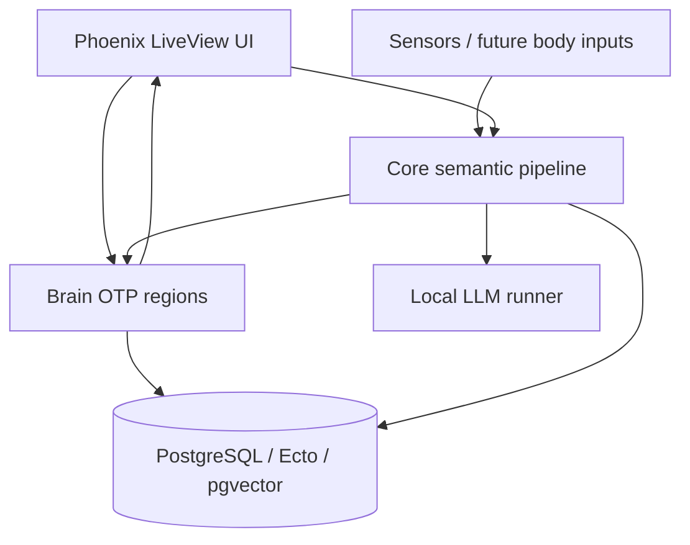

# Symbrella

**Neuro-Symbolic Synthetic Intelligence for Elixir/Phoenix**

Symbrella is a Phoenix umbrella application that experiments with a long-lived,
inspectable biologically-inspired computational architecture. It models
cognition as cooperating OTP processes: working memory, hippocampal recall,
language interpretation, mood, curiosity, attention gates, action selection,
and local LLM support.

The project treats a phone, browser, VR cockpit, or future robot as a possible
body, while the umbrella application acts as the brain-like runtime. The goal is
not to hide all reasoning behind one model call. The goal is to make the
cognitive loop visible, testable, and debuggable.

Symbrella's region names are engineering analogies grounded in broad functional
neuroscience. They are computational analogues and functional correlates, not
claims of biological equivalence. Symbrella is not a neuron-for-neuron brain
simulation, not a clinically validated neurological model, and not proof of
consciousness, sentience, feelings, or subjective experience.

## Runtime Stack

- **Erlang/OTP:** 28
- **Elixir:** 1.18.x
- **Phoenix:** 1.8.x with Bandit
- **UI:** Phoenix LiveView, Tailwind CSS v4, esbuild
- **Persistence:** Ecto, PostgreSQL, pgvector-ready schemas
- **LLM integration:** local llama.cpp / `llama-server` runner plus `Req` HTTP client

## What Symbrella Does Today

Symbrella currently provides:

- A supervised OTP brain runtime with named regions such as LIFG, PMTG, ATL,
  Hippocampus, ACC, OFC, Thalamus, BasalGanglia, DLPFC, Cerebellum, Mood, and
  Curiosity.
- A `Core.resolve_input/2` semantic pipeline for tokenization, word-gram
  rebuilding, MWE injection, memory lookup, evidence attachment, perception,
  LIFG decisions, response planning, hippocampal encoding, and activation
  telemetry.
- Working-memory policy/mechanics with capacity, decay, duplicate handling,
  diversity, fallback, and threshold controls, plus ongoing consolidation toward
  BasalGanglia-owned general admission.
- Hippocampus-backed episode persistence through the `Db` app.
- Local model orchestration through the `Llm` app.
- Phoenix LiveView surfaces for chat/home, brain inspection, episodes, mood
  HUDs, region overlays, and telemetry-driven panels.
- Test coverage for tokenizer invariants, LIFG/WM contracts, hippocampal
  persistence, curiosity/thalamus flow, DB schemas, and LiveView surfaces.
- Initial Phase 9 self-state coupling, where bounded `Brain.SelfModel` signals
  such as vigilance, uncertainty, inhibition, and cognitive load can affect WM
  admission scoring through existing policy code.

## Umbrella Apps

| App | Purpose |
| --- | --- |
| `apps/brain` | OTP brain regions, LIFG Stage1/Stage2, BasalGanglia admission control, working memory mechanics, Hippocampus, Thalamus, DLPFC, Mood, Curiosity, Cerebellum, self-state, cycle metrics, telemetry, and region macros. |
| `apps/core` | Semantic orchestration: tokenization, `Core.SemanticInput`, MWE stages, LTM evidence, perception, LIFG attachment, event frames, response planning, and brain integration. |
| `apps/db` | Ecto repo `Db`, migrations, schemas, pgvector types, JSONL import tools, episodes, brain cells, agency events, cerebellum models, and self snapshots. |
| `apps/lexicon` | External dictionary and lexical adapter surface used by Core enrichment. |
| `apps/llm` | Local LLM daemon, boot gate, model control, prompts, embeddings/chat HTTP calls, and llama.cpp integration. |
| `apps/symbrella` | Main runtime supervisor for shared infrastructure, Db, Brain regions, LLM services, PubSub, and telemetry bridges. |
| `apps/symbrella_web` | Phoenix endpoint, router, LiveViews, components, region art, brain dashboard, chat/home UI, episode browser, and assets. |

## High-Level Architecture


```mermaid
flowchart TD
  UI["Phoenix LiveView UI"]
  Core["Core semantic pipeline"]
  Brain["Brain OTP regions"]
  Db[("PostgreSQL / Ecto / pgvector")]
  Llm["Local LLM runner"]
  Sensors["Sensors / future body inputs"]

  Sensors --> Core
  UI --> Core
  UI --> Brain
  Core --> Brain
  Brain --> Db
  Core --> Db
  Core --> Llm
  Brain --> UI
```

## Cognitive Control Architecture

Symbrella's intended control structure is recurrent cortical /
basal-ganglia / thalamic control expressed as software responsibilities. For
documentation and implementation planning, the main forward path is:

```text
Semantic / lexical representations
-> LIFG Stage1
   competitive semantic interpretation
   "Which interpretation is winning?"
-> LIFG Stage2
   linguistic evidence finalization
   winner / score / margin / ambiguity / conflict
   "How strong was the linguistic decision?"
-> ACC / cognitive-control context
   conflict / uncertainty / task pressure
-> BasalGanglia
   canonical Working Memory admission gate
   :allow | :boost | :block
   "Should this representation update WM?"
-> Thalamic relay / gating control
-> DLPFC / PFC control
   task-relevant maintenance / control
-> WorkingMemory
   maintain / normalize / merge / decay / evict
```

This is not meant to imply that human cognition is a simple one-way assembly
line. Feedback is part of the architecture:

```text
WorkingMemory / PFC
-> LIFG context
-> BasalGanglia context
-> memory retrieval
-> attention/control
-> SelfModel evidence
```

Current implementation:

- `Brain.LIFG.Stage1` performs competitive semantic / word-sense selection and
  emits winner information, confidence-like scores, margins, finalists, audit
  data, and control evidence.
- `Brain.LIFG.Stage2` exists and currently has commit-shaped behavior in parts
  of the code. Architecturally it should finalize linguistic evidence for a
  downstream gate, not serve as the canonical final Working Memory admission
  authority.
- `Brain.BasalGanglia` is the intended general Working Memory admission gate. It
  owns decisions such as `:allow`, `:boost`, and `:block` over candidate
  representations.
- `Brain.WM.Policy` currently contains both admission and retention mechanics,
  while `Brain.WorkingMemory` owns maintained active-representation mechanics.
  Phase 9 work is consolidating general admission under `Brain.BasalGanglia`.
- `Brain.SelfModel` integrates runtime evidence and can provide bounded
  modulation to cognitive control, but it is not itself the gate.

Architectural target:

```text
LIFG Stage1
-> LIFG Stage2 linguistic evidence
-> BasalGanglia canonical cognitive admission decision
-> PFC / WorkingMemory control
-> WorkingMemory mechanics
```

## Core Cognitive Pipeline

The production path starts in `Core.resolve_input/2` and currently follows this
shape:

```elixir
phrase
|> Core.LIFG.Input.tokenize(max_wordgram_n: max_n)
|> Core.TokenFilters.rebuild_word_ngrams(max_n)
|> Core.Intent.Selection.select(opts)
|> Core.Brain.STM.run()
|> Core.MWE.Stage.run(:early, opts)
|> Core.Pipeline.LTM.run(opts)
|> Core.MWE.Stage.run(:late, opts)
|> Core.Relations.attach_edges()
|> Core.Brain.Episodes.attach(opts)
|> Core.Pipeline.Perception.run(opts)
|> Core.Brain.Amygdala.react(opts)
|> Core.LIFG.Attach.run_and_attach(lifg_opts)
|> Core.Semantic.EventFrames.attach(opts)
|> Core.Brain.Prefrontal.attach(opts)
|> Core.Brain.ActionSelection.attach(opts)
|> Core.Brain.WM.focus_prompt_topics(opts)
|> Core.Response.Attach.maybe_build_response_plan(opts)
|> Core.Brain.Hippocampus.encode()
|> Core.Brain.Hippocampus.persist(opts)
|> Core.Brain.Activation.notify(opts)
```

That pipeline is intentionally explicit. Each stage can attach evidence,
telemetry, trace entries, or persisted memory without making the whole system a
single opaque model call.

## Agency Path

Symbrella already has the scaffold for agency, but the current path is still
mostly internal decision-making rather than full agentic execution. The system
can inspect itself, update a self-model, select a response posture, record
agency events, reflect on outcomes, and recall recent agency pressure. The next
architectural step is to make the decision/action contract explicit before
adding more external abilities.

Current agency-related surfaces include:

- `Brain.ActionSelector` and `Core.Brain.ActionSelection` for selecting the
  next response posture.
- `Brain.SelfModel`, `Core.Brain.Introspection`, and `Brain.MetaMonitor` for
  self-state, warnings, and recovery suggestions.
- `Brain.GoalStack` for active cognitive goals, currently strongest around
  uncertainty reduction.
- `Core.Response.AgencyLedger`, `Core.Response.AgencyMemory`, and
  `Core.Response.AgencyReflection` for event recording, recent pressure, and
  response-level reflection.
- `Brain.Camera.ObservationBridge` for conservative sensor observations that can
  enter the cognitive loop without claiming ungrounded visual understanding.

The desired agency loop is:

```text
Perceive
-> Appraise
-> Self-monitor
-> Select action
-> Build command
-> Check permission/risk
-> Execute or defer
-> Record event
-> Reflect
-> Learn pressure for next time
```

Today the main missing middle is the controlled command boundary:

- an `Agency.Decision` shape that carries selected action, candidates, reasons,
  self-state, confidence, uncertainty, risk, permission needs, expected outcome,
  actual outcome, reflection, and trace identity;
- an `Agency.Command` shape for explicit requested actions such as
  `:write_memory`, `:run_self_check`, `:set_goal`, `:complete_goal`, or
  `:observe_environment`;
- an `Agency.Executor` or actuator boundary that rejects unknown commands by
  default, applies risk and permission policy, records every command, and keeps
  world-changing actions out of ordinary response-selection code.

The core rule for future agency work is:

```text
ActionSelector chooses.
Executor acts.
Ledger records.
Reflection evaluates.
Memory learns.
```

This keeps Symbrella's agency path inspectable and testable while leaving room
for later capabilities such as repository search, file edits, embodied sensing,
and other external actions.

## Brain Runtime

The root supervisor in `apps/symbrella` starts the shared runtime:

- `Db`
- `Brain.Registry` and `Brain.CellSup`
- `Phoenix.PubSub`
- `Llm` and `Llm.BootGate`
- mood and policy processes
- LIFG Stage1/Stage2 scoring and evidence finalization
- named brain regions
- curiosity/thalamus/BasalGanglia/DLPFC/WM loop
- blackboard and self-continuity processes
- optional camera observation bridge

Region modules use the local region macro:

```elixir
defmodule Brain.SomeRegion do
  use Brain, region: :some_region
end
```

This keeps brain regions as normal Elixir modules and OTP processes instead of a
separate agent framework.

## Curiosity And Attention Loop

A concrete runtime loop exists today:

```text
Curiosity -> Thalamus -> BasalGanglia -> DLPFC -> WorkingMemory
```

In broad terms:

1. `Brain.Curiosity` proposes a probe.
2. `Brain.Thalamus` relays and arbitrates curiosity with OFC value, ACC
   conflict, mood, and control context. It is not the semantic decision-maker.
3. `Brain.BasalGanglia` is the intended canonical cognitive admission gate,
   scoring candidates against evidence strength, attention/salience, WM
   fullness, duplicates, cooldown, source preferences, goals/control context,
   conflict, and bounded self-state modulation.
4. `Brain.DLPFC` / PFC acts as an executive-control analogue over allowed or
   boosted decisions. It should not become an uncontrolled direct writer to WM.
5. `Brain.WorkingMemory` normalizes, maintains, merges, activates, decays,
   trims, evicts, and emits telemetry for admitted active representations.

Current code still has overlapping gate-like behavior in `Brain.LIFG.Stage2`,
`Brain.WM.Policy`, and `Brain.BasalGanglia`. Phase 9A tracks the consolidation
work so all WM ingress paths eventually obey the same inspectable cognitive
gate.

Tests around this loop live under `apps/brain/test/brain`.

## Quickstart

From the umbrella root:

```bash
mix deps.get
mix db.setup
mix assets.build
mix phx.server
```

Open:

```text
http://localhost:4000
```

If you are setting up asset tool binaries for the first time:

```bash
cd apps/symbrella_web
mix tailwind.install --if-missing
mix esbuild.install --if-missing
cd ../../
```

## Common Commands

```bash
# compile the umbrella
mix compile

# run all tests; this also prepares the test DB and clears negcache
mix test

# run a specific test file
mix test apps/brain/test/brain/curiosity_flow_test.exs

# format code
mix format

# build assets
mix assets.build

# production-style asset build
mix assets.deploy

# reset local DB
mix db.reset
```

## Database Notes

The root aliases target the `Db` repo:

```bash
mix db.setup
mix db.migrate
mix db.rollback
mix db.migrations
mix db.reset
```

Episode, self-snapshot, agency-event, brain-cell, and cerebellum-model schemas
live in `apps/db`. JSONL import helpers live under `apps/db/lib/db/jsonl`.

## Local LLM Notes

The `apps/llm` application owns local model boot and HTTP integration. It is
designed around llama.cpp / `llama-server` and uses `Req` for HTTP requests.

Do not add HTTP client dependencies such as HTTPoison, Tesla, or `:httpc` for
new work in this codebase. Use `Req`.

## Project Invariants

Important current contracts:

- LIFG token paths operate on word tokens and word-grams, not character-grams.
- MWE candidates are injected at word boundaries.
- Sense slates are carried on `Core.SemanticInput`.
- LIFG selects/interprets; BasalGanglia gates; WorkingMemory maintains;
  SelfModel modulates; Core orchestrates.
- Working memory is newest-first, bounded, and controlled through explicit
  policy knobs.
- New WM ingress paths should flow through the canonical cognitive admission
  gate rather than inserting arbitrary candidates directly into
  `Brain.WorkingMemory`. Existing transitional paths remain roadmap work.
- Curiosity decisions emit telemetry with score and decision metadata.
- Agency decisions must stay traceable from action selection through response
  metadata, ledger events, reflection, and memory pressure.
- Durable memory writes and world-changing actions should be governed by an
  explicit command and permission policy, with low-level telemetry and ledger
  traces as the exception.
- LiveView collection rendering should use streams for growing collections.
- Phoenix templates should use HEEx, `Layouts.app`, imported form/input
  components, and Tailwind classes.

See `SYMBRELLA_PROJECT_GUARDRAILS.md` for deeper boundaries and approval rules.

## Repository Guide

- `README_BRAIN_CHAIN.md` - deeper notes on the brain chain.
- `SYMBRELLA_PROJECT_GUARDRAILS.md` - project invariants, boundaries, and approval protocol.
- `ROADMAP.md` - planning notes.
- `PROJECT-RESUME-PLAYBOOK.md` - continuation and handoff notes.
- `docs/brain-core-scientific-contract.md` - brain/core contract notes.
- `docs/modulator-to-prompt-contract.md` - modulator-to-prompt interface notes.
- `apps/*/README.md` - app-local notes where present.

## Development Style

This project favors explicit Elixir/Phoenix code over hidden orchestration:

- use OTP processes for runtime state and region behavior;
- keep cognitive stages independently testable;
- preserve telemetry and trace data for debugging;
- treat errors as useful developer feedback;
- avoid broad `try`/`rescue` wrappers unless there is a narrow, justified
  boundary;
- keep UI behavior in LiveView modules and `assets/js`, not inline scripts.

## Current Status

Symbrella is an active research and application codebase. It is not a packaged
library and not a generic chatbot shell. The most important thing to preserve is
the inspectable cognitive architecture: named regions, explicit memory, visible
control flow, and a clear route from text interaction to embodied input/output.

The current roadmap frontier is Phase 9: cognitive gating consolidation and
behavior coupling. The key architectural cleanup is to consolidate general
Working Memory admission around `Brain.BasalGanglia` while preserving bounded
self-state modulation, telemetry, and explicit tests for gate bypasses.
