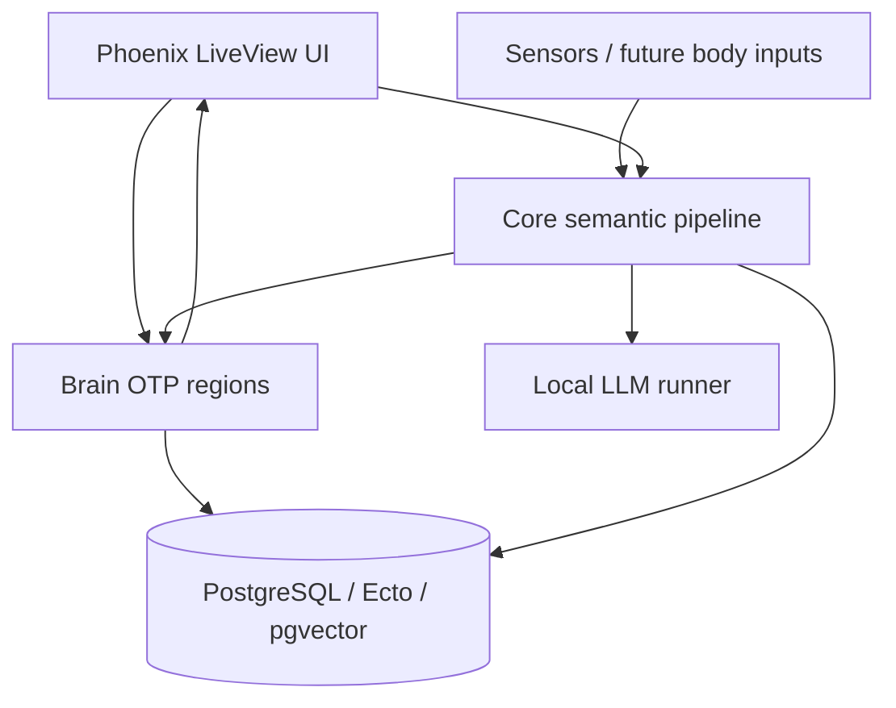

# Symbrella

**Neuro-Symbolic Synthetic Intelligence for Elixir/Phoenix**

Symbrella is a Phoenix umbrella application that experiments with a long-lived,
inspectable synthetic brain. It models cognition as cooperating OTP processes:
working memory, hippocampal recall, language interpretation, mood, curiosity,
attention gates, action selection, and local LLM support.

The project treats a phone, browser, VR cockpit, or future robot as a possible
body, while the umbrella application acts as the brain. The goal is not to hide
all reasoning behind one model call. The goal is to make the cognitive loop
visible, testable, and debuggable.

## Runtime Stack

- **Erlang/OTP:** 28
- **Elixir:** 1.18.x
- **Phoenix:** 1.8.x with Bandit
- **UI:** Phoenix LiveView, Tailwind CSS v4, esbuild
- **Persistence:** Ecto, PostgreSQL, pgvector-ready schemas
- **LLM integration:** local llama.cpp / `llama-server` runner plus `Req` HTTP client

## What Symbrella Does Today

Symbrella currently provides:

- A supervised OTP brain runtime with named regions such as LIFG, PMTG, ATL,
  Hippocampus, ACC, OFC, Thalamus, Basal Ganglia, DLPFC, Cerebellum, Mood, and
  Curiosity.
- A `Core.resolve_input/2` semantic pipeline for tokenization, word-gram
  rebuilding, MWE injection, memory lookup, evidence attachment, perception,
  LIFG decisions, response planning, hippocampal encoding, and activation
  telemetry.
- Working-memory admission policies with capacity, decay, duplicate handling,
  diversity, fallback, and threshold controls.
- Hippocampus-backed episode persistence through the `Db` app.
- Local model orchestration through the `Llm` app.
- Phoenix LiveView surfaces for chat/home, brain inspection, episodes, mood
  HUDs, region overlays, and telemetry-driven panels.
- Test coverage for tokenizer invariants, LIFG/WM contracts, hippocampal
  persistence, curiosity/thalamus flow, DB schemas, and LiveView surfaces.

## Umbrella Apps

| App | Purpose |
| --- | --- |
| `apps/brain` | OTP brain regions, working memory, LIFG stage scoring, Hippocampus, Thalamus, DLPFC, Mood, Curiosity, Cerebellum, cycle metrics, telemetry, and region macros. |
| `apps/core` | Semantic orchestration: tokenization, `Core.SemanticInput`, MWE stages, LTM evidence, perception, LIFG attachment, event frames, response planning, and brain integration. |
| `apps/db` | Ecto repo `Db`, migrations, schemas, pgvector types, JSONL import tools, episodes, brain cells, agency events, cerebellum models, and self snapshots. |
| `apps/lexicon` | External dictionary and lexical adapter surface used by Core enrichment. |
| `apps/llm` | Local LLM daemon, boot gate, model control, prompts, embeddings/chat HTTP calls, and llama.cpp integration. |
| `apps/symbrella` | Main runtime supervisor for shared infrastructure, Db, Brain regions, LLM services, PubSub, and telemetry bridges. |
| `apps/symbrella_web` | Phoenix endpoint, router, LiveViews, components, region art, brain dashboard, chat/home UI, episode browser, and assets. |

## High-Level Architecture


```mermaid
flowchart TD
  UI["Phoenix LiveView UI"]
  Core["Core semantic pipeline"]
  Brain["Brain OTP regions"]
  Db[("PostgreSQL / Ecto / pgvector")]
  Llm["Local LLM runner"]
  Sensors["Sensors / future body inputs"]

  Sensors --> Core
  UI --> Core
  UI --> Brain
  Core --> Brain
  Brain --> Db
  Core --> Db
  Core --> Llm
  Brain --> UI
```

## Core Cognitive Pipeline

The production path starts in `Core.resolve_input/2` and currently follows this
shape:

```elixir
phrase
|> Core.LIFG.Input.tokenize(max_wordgram_n: max_n)
|> Core.TokenFilters.rebuild_word_ngrams(max_n)
|> Core.Intent.Selection.select(opts)
|> Core.Brain.STM.run()
|> Core.MWE.Stage.run(:early, opts)
|> Core.Pipeline.LTM.run(opts)
|> Core.MWE.Stage.run(:late, opts)
|> Core.Relations.attach_edges()
|> Core.Brain.Episodes.attach(opts)
|> Core.Pipeline.Perception.run(opts)
|> Core.Brain.Amygdala.react(opts)
|> Core.LIFG.Attach.run_and_attach(lifg_opts)
|> Core.Semantic.EventFrames.attach(opts)
|> Core.Brain.Prefrontal.attach(opts)
|> Core.Brain.ActionSelection.attach(opts)
|> Core.Brain.WM.focus_prompt_topics(opts)
|> Core.Response.Attach.maybe_build_response_plan(opts)
|> Core.Brain.Hippocampus.encode()
|> Core.Brain.Hippocampus.persist(opts)
|> Core.Brain.Activation.notify(opts)
```

That pipeline is intentionally explicit. Each stage can attach evidence,
telemetry, trace entries, or persisted memory without making the whole system a
single opaque model call.

## Brain Runtime

The root supervisor in `apps/symbrella` starts the shared runtime:

- `Db`
- `Brain.Registry` and `Brain.CellSup`
- `Phoenix.PubSub`
- `Llm` and `Llm.BootGate`
- mood and policy processes
- LIFG Stage-1 scoring
- named brain regions
- curiosity/thalamus/DLPFC/WM loop
- blackboard and self-continuity processes
- optional camera observation bridge

Region modules use the local region macro:

```elixir
defmodule Brain.SomeRegion do
  use Brain, region: :some_region
end
```

This keeps brain regions as normal Elixir modules and OTP processes instead of a
separate agent framework.

## Curiosity And Attention Loop

A concrete runtime loop exists today:

```text
Curiosity -> Thalamus -> BasalGanglia -> DLPFC -> WorkingMemory
```

In broad terms:

1. `Brain.Curiosity` proposes a probe.
2. `Brain.Thalamus` blends curiosity with OFC value, ACC conflict, and mood.
3. `Brain.BasalGanglia` scores admission against WM capacity, duplicates,
   source preferences, and cooldowns.
4. `Brain.DLPFC` acts on allowed or boosted thalamic decisions.
5. `Brain.WorkingMemory` normalizes, merges, decays, trims, and emits telemetry.

Tests around this loop live under `apps/brain/test/brain`.

## Quickstart

From the umbrella root:

```bash
mix deps.get
mix db.setup
mix assets.build
mix phx.server
```

Open:

```text
http://localhost:4000
```

If you are setting up asset tool binaries for the first time:

```bash
cd apps/symbrella_web
mix tailwind.install --if-missing
mix esbuild.install --if-missing
cd ../../
```

## Common Commands

```bash
# compile the umbrella
mix compile

# run all tests; this also prepares the test DB and clears negcache
mix test

# run a specific test file
mix test apps/brain/test/brain/curiosity_flow_test.exs

# format code
mix format

# build assets
mix assets.build

# production-style asset build
mix assets.deploy

# reset local DB
mix db.reset
```

## Database Notes

The root aliases target the `Db` repo:

```bash
mix db.setup
mix db.migrate
mix db.rollback
mix db.migrations
mix db.reset
```

Episode, self-snapshot, agency-event, brain-cell, and cerebellum-model schemas
live in `apps/db`. JSONL import helpers live under `apps/db/lib/db/jsonl`.

## Local LLM Notes

The `apps/llm` application owns local model boot and HTTP integration. It is
designed around llama.cpp / `llama-server` and uses `Req` for HTTP requests.

Do not add HTTP client dependencies such as HTTPoison, Tesla, or `:httpc` for
new work in this codebase. Use `Req`.

## Project Invariants

Important current contracts:

- LIFG token paths operate on word tokens and word-grams, not character-grams.
- MWE candidates are injected at word boundaries.
- Sense slates are carried on `Core.SemanticInput`.
- Working memory is newest-first and controlled through explicit policy knobs.
- Curiosity decisions emit telemetry with score and decision metadata.
- LiveView collection rendering should use streams for growing collections.
- Phoenix templates should use HEEx, `Layouts.app`, imported form/input
  components, and Tailwind classes.

See `SYMBRELLA_PROJECT_GUARDRAILS.md` for deeper boundaries and approval rules.

## Repository Guide

- `README_BRAIN_CHAIN.md` - deeper notes on the brain chain.
- `SYMBRELLA_PROJECT_GUARDRAILS.md` - project invariants, boundaries, and approval protocol.
- `ROADMAP.md` - planning notes.
- `PROJECT-RESUME-PLAYBOOK.md` - continuation and handoff notes.
- `docs/brain-core-scientific-contract.md` - brain/core contract notes.
- `docs/modulator-to-prompt-contract.md` - modulator-to-prompt interface notes.
- `apps/*/README.md` - app-local notes where present.

## Development Style

This project favors explicit Elixir/Phoenix code over hidden orchestration:

- use OTP processes for runtime state and region behavior;
- keep cognitive stages independently testable;
- preserve telemetry and trace data for debugging;
- treat errors as useful developer feedback;
- avoid broad `try`/`rescue` wrappers unless there is a narrow, justified
  boundary;
- keep UI behavior in LiveView modules and `assets/js`, not inline scripts.

## Current Status

Symbrella is an active research and application codebase. It is not a packaged
library and not a generic chatbot shell. The most important thing to preserve is
the inspectable cognitive architecture: named regions, explicit memory, visible
control flow, and a clear route from text interaction to embodied input/output.
